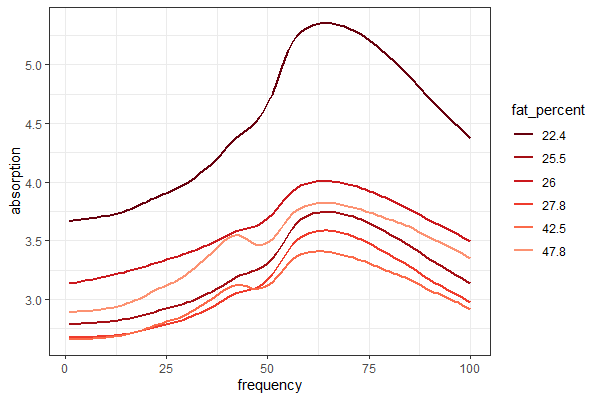

```{r setup, include=FALSE}
knitr::opts_chunk$set(echo = TRUE)
library(knitr)
library(tidyverse)
```

# Read through the entirety of this exam before getting started

## Exam Logistics

*Reprinted from course website*

1. The exam will be **lightly cumulative**, but with emphasis on material covered since the first midterm. In particular, it will focus on Chapters 4, 6 and 8.1 of ISLR, including topics we discussed in class through Friday 11-12.

2. The exam will be made available on GitHub at 5pm PDT on Friday, 11-19. A link to the exam will be posted in the `#announcements` channel on Slack.

3. You must submit your completed exam via pushing any commits to GitHub prior to 9:00am PDT on Monday, 11-22.

4. This is a timed exam. You may take up to 3 hours to work on the exam between Friday and Monday. This time does not need to be spent consecutively. However, if you take a break from the exam, you should not spend the time during that break working on the exam, reviewing notes, or actively thinking about the problems.

5. You are responsible for keeping track of your own time on the exam and will be asked to provide an estimate for the total amount of time you spent.


6. You may freely consult the following references during the exam:
  - Your ISLR and Applied Predictive Modeling textbooks
  - Any course notes **you** have taken for this class
  - Cheatsheats or notes from other classes, provided **you** were the one to create the notes
  - Lecture slides on the course website
  - Homework problems you have submitted
  - Built-in RStudio help files and cheatsheets
  
7. You may not consult any other resources, including (but not limited to):
  - Classmates
  - Tutors
  - Other faculty
  - Other textbooks
  - Online help (stackexchange, message boards, slack, etc.)
  
  
8. If you run into problems while taking the exam, document the problem in your exam and message me on slack. I will try to respond as soon as I can, but can't guarantee I will available at that moment.


*******************************************************

## Instructions 

Each of the following 4 problems will be worth approximately equal number of points. Compose your answer to each problem between the bars of red stars. Show your work and justify your answers.


## Problem 1


Your goal in this problem is to create an email spam filter which blocks unwanted and unsolicited email (advertisements, scams, chain letters, etc.) while still allows legitimate emails to pass through. The following data set was compiled from David Diez's Gmail Account, early months of 2012, and consists of 19 predictors and 1 response on 3921 emails.

```{r message = F,warning = F}
email <- read_csv("email.csv") %>% mutate(spam = as.factor(spam))
```

Below is a description of all variables that appear in the data set. 

- `spam` Indicator for whether the email was spam. This is the response variable.

- `to_multiple` Indicator for whether the email was addressed to more than one recipient.

- `from` Whether the message was listed as from anyone (this is usually set by default for regular outgoing email).

- `cc` Number of people cc'ed.

- `sent_email` Indicator for whether the sender had been sent an email in the last 30 days.

- `image` The number of images attached.

- `attach` The number of attached files.

- `dollar` The number of times a dollar sign or the word “dollar” appeared in the email.

- `winner` Indicates whether “winner” appeared in the email.

- `inherit` The number of times “inherit” (or an extension, such as “inheritance”) appeared in the email.

- `viagra` The number of times “viagra” appeared in the email.

- `password` The number of times “password” appeared in the email.

- `num_char` The number of characters in the email, in thousands.

- `line_breaks` The number of line breaks in the email (does not count text wrapping).

- `format` Indicates whether the email was written using HTML (e.g. may have included bolding or active links).

- `re_subj` Whether the subject started with “Re:”, “RE:”, “re:”, or “rE:”

- `exclaim_subj` Whether there was an exclamation point in the subject.

- `urgent_subj` Whether the word “urgent” was in the email subject.

- `exclaim_mess` The number of exclamation points in the email message.

- `number` Factor variable saying whether there was no number, a small number (under 1 million), or a big number.


a. (4) Choose 4 of the predictors above and create appropriate visualizations showing their individual distribution, as well as their relationship to the response `spam`. What are some trends demonstrated by the plots? Based on your preliminary analysis, which predictor do you think would be most helpful in classifying spam?

b. (1) Randomly divide the data into a training and test set using a 75-25 ratio. Be sure to set a seed to ensure reproducibility.

c. (4) Fit a logistic regression model predicting `spam` as a function of other variables. Create a confusion matrix on test data, compute the test error rate, and create an ROC curve.

d. (2) Based on your findings in part (a), explain why neither a LDA nor a QDA model would be appropriate for this data.

e. (4) Fit a tuned KNN classification model predicting `spam` as a function of other variables. Create a confusion matrix on test data, compute the test error rate, and create an ROC curve.

f. (4) Fit a pruned classification tree predicting `spam` as a function of other variables. Create a confusion matrix on test data, compute the test error rate, and create an ROC curve.

g. (3) Compare the results of the previous steps. Which model had the highest accuracy? Did any models differ significantly in their sensitivity or specificity?

h. (3) In the context of an email spam filter, which type of misclassification error is worse: classifying a legitimate email as spam, or classifying a spam email as legitimate? Explain how you could modify one of the procedures in part (c), (e), or (f) to reduce this type of error.


*******************************************************


a. 

```{r message = F, warning = F}
library(gridExtra)
theme_set(theme_bw())
p1<-ggplot(email, aes(x = number))+geom_bar()+theme_bw()
p2<-ggplot(email, aes(x = num_char ))+geom_histogram(bins = 25, color = "white")
p3<-ggplot(email, aes(x = dollar ))+geom_histogram(bins = 25, color = "white")
p4<-ggplot(email, aes(x = from))+geom_bar()
grid.arrange(p1,p2,p3,p4, ncol = 2)

g1 <- ggplot(email, aes(x = number, fill = spam))+geom_bar(position = "fill")
g2 <- ggplot(email, aes(x = num_char, y = spam))+geom_boxplot()
g3 <- ggplot(email, aes(x = dollar, y = spam))+geom_boxplot()
g4 <-  ggplot(email, aes(x = from, fill = spam))+geom_bar(position = "fill")
grid.arrange(g1,g2,g3,g4, ncol = 2)
```

- Almost all emails without a sender are spam. However, very few emails overall do not have a sender.

- Both `dollar` and `num_char` appear slightly negatively correlated with `spam` (i.e. emails with larger values of the variable are less likely to be spam)

- Overall, none of the 4 variables on their own are likely to be particularly informative for predicting spam.


b. 

```{r}
set.seed(10)
library(rsample)
email_split <- initial_split(email, strata = spam)
email_train <- training(email_split)
email_test <- testing(email_split)
```

c. 

```{r}
email_log <- glm(spam ~ ., family = "binomial", data = email_train)
email_log_probs <- predict(email_log, email_test, type = "response")
email_log_preds <-  as.factor(ifelse(email_log_probs > .5, 1, 0))

email_results <- data.frame(obs = email_test$spam, preds = email_log_preds, probs = email_log_probs, model = "logistic")
```

```{r}
library(yardstick)
email_results %>% filter(model == "logistic") %>% conf_mat(truth = obs, estimate = preds)
email_results %>% filter(model == "logistic") %>% accuracy(truth = obs, estimate = preds)
email_results %>% filter(model == "logistic") %>% roc_curve(truth = obs, probs, event_level = "second") %>% 
  autoplot()
```


d. Since `email` contains several categorical predictors (which cannot be Normally distributed), then neither LDA nor QDA is appropriate, since both assume that the conditional distribution of predictors given response are Normally distributed.

e. 

```{r}
set.seed(1)
library(kknn)
email_knn_tune <- train.kknn(spam ~., data = email_train, ks = 1+2*0:15, kernel = "rectangular")
email_knn_tune$MISCLASS %>% as.data.frame() %>% 
  rownames_to_column() %>% rename(k = rowname, error = rectangular) %>% mutate(k = as.numeric(k)) %>% 
  ggplot(aes(x = k, y = error))+ geom_point()

best_k <- email_knn_tune$best.parameters$k

email_knn_mod <- kknn(spam~., train = email_train, test = email_test, k = best_k, kernel = "rectangular")
email_knn_preds <- as.factor(email_knn_mod$fitted.values)
email_knn_probs <-  email_knn_mod$prob[,2]

email_results <- email_results %>% rbind(
  data.frame(obs = email_test$spam, preds = email_knn_preds, probs = email_knn_probs, model = "knn")
)
```

```{r}
email_results %>% filter(model == "knn") %>% conf_mat(truth = obs, estimate = preds)
email_results %>% filter(model == "knn") %>% accuracy(truth = obs, estimate = preds)
email_results %>% filter(model == "knn") %>% roc_curve(truth = obs, probs, event_level = "second") %>% 
  autoplot()
```

f.

```{r}
library(rpart)
library(rpart.plot)
email_tree <- rpart(spam ~., data = email_train, control = rpart.control(cp = 0.001, minsplit = 20))
rpart.plot(email_tree)
plotcp(email_tree)

email_pruned <- prune(email_tree, cp = 0.01)
rpart.plot(email_pruned)

email_pruned_preds <- predict(email_pruned, email_test, type = "class")
email_pruned_probs <- predict(email_pruned, email_test, type = "prob")[,2]

email_results <- email_results %>% rbind(
  data.frame(obs = email_test$spam, preds = email_pruned_preds, probs = email_pruned_probs, model = "tree")
)
```

```{r}
email_results %>% filter(model == "tree") %>% conf_mat(truth = obs, estimate = preds)
email_results %>% filter(model == "tree") %>% accuracy(truth = obs, estimate = preds)
email_results %>% filter(model == "tree") %>% roc_curve(truth = obs, probs, event_level = "second") %>% 
  autoplot()
```

g. All three models had relatively similar accuracy (with KNN slightly outperforming the tree). The logistic model had the greatest sensitivity, while the knn and tree models had the greatest specificity. 

```{r}
my_metrics <- metric_set(accuracy, sensitivity, specificity)
email_results %>% group_by(model) %>% my_metrics(truth = obs, estimate = preds)
```

h. I would prefer that the email filter misclassify spam as legitimate email than misclassify legitimate email as spam. That is, I would prefer a spam filter with relatively high sensitivity. In this case, it seems the logistic model is preferable. Alternatively, we could increase the decision threshold for classifying an email as spam from 0.5 to something slightly higher. 

*******************************************************

## Problem 2

Infrared (IR) spectroscopy technology is used to determine the chemical makeup of a substance. The theory of IR spectroscopy holds that unique molecular structures absorb IR frequencies differently. In practice a spectrometer fires a series of different IR frequencies into a sample material, and the device measures the absorbency of the sample at each individual frequency. This series of measurements creates a spectrum profile which can then be used to determine the chemical makeup of the sample material.

A particular IR instrument was used to analyze 215 samples of meat across 100 frequencies (corresponding to wavelengths between 850 and 1050 nm). The frequency spectra for 6 samples are shown below, along with the percent fat content of the sample, as determined by analytic chemistry.

```{r}

```

If researchers can determine a predictive relationship between IR spectrum and fat content, then food scientists could predict a sample's fat content with IR instead of more expensive analytic chemistry.

The following code chunk loads the `irdata`, which contains absorption values at 100 different frequencies, as well as fat content, for 215 meat samples. Additionally, it separates the data into training and test sets.

```{r message = F}
irdata<-read_csv("irdata.csv")

library(rsample)
set.seed(1119) #Do not change this seed
ir_split <- initial_split(irdata)
ir_train <- training(ir_split)
ir_test <- testing(ir_split)
```

a. (2) Based on the graphic shown above, what is the approximate relationship between the average absorption of a sample and its fat content? Are there any outliers to this trend?

b. (3) The `irdata` contains 100 predictors (one for each IR frequency) on 215 observations. Based on the graphic above, do these predictors appear to be uncorrelated? (Think very carefully about how predictors are represented in this graph)  What influence do you think this may have on model accuracy, especially in light of the sample size?

c. (5) Fit a full linear model. Create and analyze the diagnostic plots for this model. 

d. (3) Explain why it would be computationally infeasible to perform best subset selection. Instead, use either forward or backward selection to create an array of linear regression models. 

e. (3) The `get_model_formula` function takes 3 arguments (a number of predictors, a `regsubsets` object, and the name of the response variable) and will extract the model formula for the best performing regression model of the given number of predictors in the `regsubsets` object.

```{r}
#Run this code to import the get_model_formula function
source('get_model_formula.R')
```

For example, the following code chunk extracts the formula for the best 3 variable linear model predicting `mpg` in the `mtcars` dataset (which can then be copy-pasted into the appropriate argument of `lm` to create a linear model)

```{r eval = F }
#Example
data(mtcars)
library(leaps)
my_mtmodels<-regsubsets(mpg~.,data=mtcars)
get_model_formula(3,my_mtmodels,"mpg")
```
Based on your forward/backward selection process, choose an optimal subset of variables and fit the corresponding linear model. Be sure to use the `get_model_formula` helper function to assist creating the formula for your model.


f. (5) Perform either ridge regression or LASSO and use cross-validation to find the optimal regression penalty. Create a parameter path plot, along with a cross-validated error plot.

h. (4) Compute the RMSE of each of your models from parts (c), (e), and (f) on the **test** data. Which model has the best predictive accuracy? Which model has the worst? What traits do each of the best performing models have in common? Explain why this makes sense, based on your answer to part (b).

 
***********************************

a. Lower fat content appear to have higher average absorptions, with the notable exception of the 47.8 percent fat sample, which had a moderate absorption.

b. Each predictor is a particular frequency. From the graph above, we see that for a given sample, the absorptions of predictors at similiar frequencies are close, suggesting that the predicted fat contents for each are **highly** correlated. As a result, we should expect model coefficients to have high amounts of variability, especially because sample size is low.

c. The Residual plot, Normal QQ plot, and Scale-Location plot show no evidence for concern. However, the leverage plot gives a very large number of points with high leverage. This is not surprising, given the strong evidence of multicolinearity observed in part (a).

```{r}
lin_mod_2 <- lm(fat~., data = ir_train)
```

```{r}
library(gglm)
gglm(lin_mod_2)
```

d. Performing best subset selection would require us to evaluate $2^{100} \approx 1.27 \times 10^{30}$ models, which is computationally infeasible. We instead use forward selection and backward selection (students can choose to do either).

```{r}
library(leaps)
fs_mod<-regsubsets(fat ~., data = ir_train, nvmax = 100, method = "forward")
bs_mod<-regsubsets(fat ~., data = ir_train, nvmax = 100, method = "backward")
```


e. To determine the optimal number of variables for each, we use the BIC metric and find BIC is minimized at $n = 25$ for FS and $n=46$ for BS.

```{r fig.height=3, message=F}
 
selection_metrics<- bind_cols(
                         fs_bic=summary(fs_mod)$bic,
                         bs_bic=summary(bs_mod)$bic,
                         n_var=1:100
) 

selection_metrics <- selection_metrics %>% pivot_longer(!n_var,
                                                        names_to = "metric",
                                                        values_to = "value" )

selection_metrics %>% 
ggplot(   aes(x = n_var, y = value, color = metric))+geom_line()

selection_metrics %>% filter(metric=="fs_bic") %>% arrange(value) %>% head()
selection_metrics %>% filter(metric=="bs_bic") %>% arrange(value) %>% head()

best_n_fs<-which.min(summary(fs_mod)$bic)
best_n_bs<-which.min( summary(bs_mod)$bic)
```

```{r}
fs_form<-get_model_formula(best_n_fs, fs_mod, "fat")
b_form<-get_model_formula(best_n_bs, bs_mod, "fat")

fs_mod<-lm(fs_form, data =  ir_train)
bs_mod<-lm(get_model_formula(best_n_bs,bs_mod, "fat"), data = ir_train)
```

f. 

```{r}
x<-model.matrix(fat~., data = ir_train)
y<-ir_train$fat

xtst<-model.matrix(fat~., data = ir_test)
ytst<-ir_test$fat
```

```{r}
set.seed(10101)
library(glmnet)

grid<-10^(seq(-5,5,length = 100))
rr_mod<-glmnet(x,y, family = "gaussian", alpha = 0 , lambda = grid)
rr_cv<-cv.glmnet(x,y, alpha = 0 , lambda = grid)
rr_l<-rr_cv$lambda.1se


lasso_mod<-glmnet(x,y, family = "gaussian", alpha = 1, lambda = grid )
lasso_cv<-cv.glmnet(x,y,alpha = 1, lambda = grid )
lasso_l<-lasso_cv$lambda.1se

data.frame(rr_l,lasso_l)
```

```{r out.width="80%"}
plot(rr_mod)
plot(rr_cv)

plot(lasso_mod)
plot(lasso_cv)
```


g. We observe that forward selection had the lowest test rMSE, followed closely by backward selection. LASSO and Ridge Regression had comparable test rMSE, while the full model performed worst by a significant margin. The best performing models all performed significant variable selection, which makes sense given the multicollinearity identified in the previous parts of this problem.

```{r}
results <- data.frame(
  obs = ir_test$fat,
  full = predict(lin_mod_2, ir_test),
  ridge = as.numeric(predict.glmnet(rr_mod, newx = xtst, s = rr_l)),
  lasso = as.numeric(predict.glmnet(lasso_mod, newx = xtst, s = lasso_l)),
  forward = predict(fs_mod, ir_test),
  backward = predict(bs_mod, ir_test)
) %>% pivot_longer(!obs, names_to = "model", values_to = "preds")

library(yardstick)

results %>% group_by(model) %>% rmse(truth = obs, estimate = preds) %>% arrange(.estimate)
```


***********************************


## Problem 3


In this problem, you will simulate data from a *logistic regression* model. 


The following code chunk generates 200 predictor values for the simulated model. **Do not change the seed value.**

```{r}
set.seed(1010)
x1 <- runif(200, 0,1) #Predictor X1
x2 <- runif(200, 0,1) #Predictor X2
sim_data<-data.frame(x1,x2) #Data frame of predictor values
```

The goal of this problem is to simulate data from a logistic regression model with parameters $\beta_0 = -5$, $\beta_1 = 6$ and $\beta_2 = 5$. 

a. (2) Write the mathematical formula for the conditional probability function $p(X)$ for this model.

b. (3) Write an R function which takes as input the values of the predictors `X1` and `X2` and outputs the conditional probability that $Y$ takes the value $1$, given those values. Plot the values of your probability function for the simulated data.

c. (2) Use `mutate` to add a column to your `sim_dat` data frame containing the conditional probability of $Y=1$ given the values of $X_1$ and $X_2$. 

d. (3) In this part, generate values of the response $Y$ using your conditional probabilities and add the results to the data frame `sim_data`. Use the following code as template to do so: 

```{r}
example_df<-data.frame(p = c(.2, .4, .6, .8)) #This creates a column of probabilities p

example_df<-example_df %>% 
  rowwise() %>% #This allows you to mutate entries in the data frame one row at a time
  mutate(Y = sample(0:1, size = 1, prob = c(1-p, p))) #This creates a sample in each row 
    #with the given probability of getting Y = 1.

example_df
#Run this code chunk several times to convince yourself that in each row, Y has the indicated
#probability of taking the value 1
```


e. (3) Create a scatterplot of your simulated data, using color to denote the values of $Y$. Estimate a reasonable linear decision boundary (just based on inspection of the graph, no calculation necessary) and add it to the plot using `geom_abline`. 

f. (5) Fit a logistic regression model for $Y$ as a function of $X_1$ and $X_2$ based on `sim_data`. How do the coefficients of your fitted model compare to the original parameters $\beta_0 = -5$, $\beta_1 = 6$ and $\beta_2 = 5$?

g. (3) Compute the training error rate on your simulated data. How do you think this compares to the theoretical Bayes classifier error rate?

h. (4) Use cross-validation to estimate the test error for the logistic regression model. How does this compare to your training error rate?


***********************************

a. The formula for the probability in a logistic regression model is
$$
P(X) = \frac{e^{-5 +6X_1 + 5 X_2}}{1 + e^{-5 +6X_1 + 5 X_2} }
$$

b.

c.

```{r}
get_probs <- function(X1, X2){
  exp(-5 +6*X1 + 5*X2)/(1 + exp(-5 +6*X1 + 5*X2) )
}

sim_data <- sim_data %>% mutate(p = get_probs(x1, x2))

ggplot(sim_data, aes(x = x1, y = x2, color = p))+geom_point()+theme_bw()+scale_colour_viridis_c(option = "plasma", end = .75)
```

d. 

```{r}
set.seed(10)
sim_data <- sim_data %>% 
rowwise() %>% #This allows you to mutate entries in the data frame one row at a time
  mutate(Y = sample(0:1, size = 1, prob = c(1-p, p)))
```

e. A plausible decision boundary might have slope -1.2 and intercept of 1.1.

```{r}
ggplot(sim_data, aes(x = x1, y = x2, color = Y))+geom_point()+theme_bw()+scale_colour_viridis_c(option = "plasma", end = .75)+geom_abline(slope = -1.2, intercept = 1.1, color = "purple4")
```


f. The model coefficients are $\hat \beta_0 = -5.3$, $\hat \beta_1 = 6.7$ and $\hat \beta_2 = 4.3$. These are somewhat close to the original parameters.

```{r}
log_mod_3 <- glm(Y ~ x1 + x2, family = "binomial", data = sim_data)
summary(log_mod_3)
```

g. The training error rate was 16%. This is probably a slight underestimate of the Bayes error rate.

```{r}
train_probs <- predict(log_mod_3, sim_data, type = "response")
train_preds <- ifelse(train_probs > 0.5, "1", "0" ) %>% as.factor()

results_3 <- data.frame(obs = as.factor(sim_data$Y), preds = train_preds)

results_3 %>% conf_mat(truth = obs, estimate = preds)
results_3 %>% accuracy(truth = obs, estimate = preds)
```

h. Using 10-fold cross-validation, the estimated accuracy is 0.825, which is likely closer to the true Bayes error rate than the training error.

```{r}
set.seed(100)
folds_10 <- vfold_cv(sim_data, v = 10)

get_preds <- function(split){
  mod <- glm(Y ~ x1 + x2, family = "binomial", data = analysis(split))
  prob <- predict(mod, assessment(split), type = "response")
  pred <- ifelse(prob > .5, "1", "0")
  out <-  data.frame(Y =  assessment(split)$Y) %>% mutate(Y = factor(Y, levels = c("0", "1")))
  out$pred <- factor(pred, levels = c("0", "1"))
  out
}

folds_10$preds <- map(folds_10$splits, get_preds)

folds_10$preds %>%  map_dfr(accuracy, Y, pred) %>% summarize(avg_acc = mean(.estimate))
```


***********************************


## Problem 4

Towards the end of an introductary statistics class (like Math 141), many students are eager to continue investigating statistics, but are unsure what types of things are covered in future classes. Choose one topic that we've studied thus far this semester, and in a **2 - 3 paragraph** response, summarize this topic and explain how it relates to the broader themes of a Statistical Learning course, as well as how it extends a concept first seen in an Intro Statistics class. The target audience for your answer should be a Math 141 student who is interested in taking Math 243. 

***********************************


***********************************