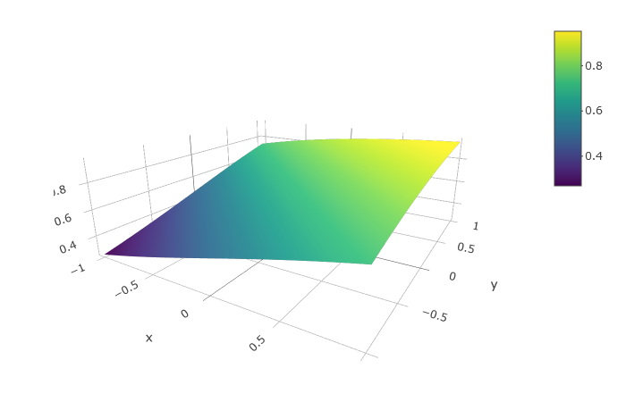

```{r setup, include=FALSE}
knitr::opts_chunk$set(
	echo = FALSE,
	fig.align = "center",
	message = FALSE,
	cache = F,
	fig.width = 6,
	fig.height = 4,
	warning = FALSE,
	out.width = "70%"
)
library(tidyverse)
library(knitr)
library(ggthemes)
library(ISLR)
library(ggforce) 
```

## Outline

In today's class, we will...

 
- Review classification problems

- Discuss Logistic Regression for Classification


# Logistic Regression

 


## Classificaiton Problems

- Suppose $Y$ is a categorical variable with levels $A_1, A_2, \dots, A_k$.

  \pause


  - Example: Let $Y$ indicate whether it is raining in Portland at noon on 10/25/21. 
  
  - Levels: $A_1 = \textrm{Raining}$, $A_2 = \textrm{Not Raining}$.
  
\pause

  - Goal: Build a model $f$ to classify an observation into levels $A_1, A_2, \dots, A_k$ based on the values of several predictors $X_1, X_2, \dots , X_p$ (quantitative or categorical)

$$
\hat{Y} = f(X_1, X_2, \dots , X_p)  \qquad \textrm{where }f  \textrm{ take values in } \{A_1, \dots , A_k\}
$$
 
## Classification Regions

Any classification model will divide predictor space into unions of regions, where each point in a region will be classified in the same way.

```{r}
set.seed(1)
n<-1000
x1<-runif(n, 0 ,1)
x2<-runif(n, 0 ,1)
r<-rnorm(100, 0, .1)
d<-data.frame(x1,x2,r) %>% mutate(y = ifelse(x2 -2*x1*(1-x1) > r, "1", "0"))

ggplot(d, aes(x = x1, y = x2, color = y))+geom_point()+theme_bw()
```

Different models will have different geometries for classification boundaries.

## Classification Regions

Any classification model will divide predictor space into unions of regions, where each point in a region will be classified in the same way.

```{r}
set.seed(1)
n<-1000
x1<-runif(n, 0 ,1)
x2<-runif(n, 0 ,1)
r<-rnorm(100, 0, .1)
d<-data.frame(x1,x2,r) %>% mutate(y = ifelse(x2 -2*x1*(1-x1) > r, "1", "0"))

my_f <- function(x){2*x*(1-x)}
t <- seq(from = 0, to = 1, length = 100)
z <- my_f(t)

ggplot()+geom_point(data =d, aes(x = x1, y = x2, color = y))+geom_line(data = data.frame(t,z), aes(x = t, y = z), size = 1, color = "purple")+theme_bw()
```

The purple line indicates the optimal decision boundary.


## The Bayes Classifier and KNN

- The Bayes classifier theoretically minimizes error rate
$$
f(x_0) = \mathrm{argmax}_{A_j} P(Y = A_j \, | \, X = x_0)
$$
  \pause
  
  - In practice, these conditional probabilities are not known.
  
\pause

- But we can approximate them using $KNN$:
$$
P(Y = A_j \, | \, X = x_0) \approx \frac{1}{K} \sum_{i \in N_0} I(y_i = A_j)
$$
\pause

- Our model for $P$ is therefore $\hat P_j(x_0) = \frac{1}{K} \sum_{i \in N_0} I(y_i = A_j)$.

\pause

- And our classifier model is $\hat g (x_0) = \mathrm{argmax}_{A_j} \hat P_j(x_0)$

## Why not always just use KNN?

1. KNN has very low training time (basically none), but often large test time (especially for large $K$)

\pause

2. KNN models are hard to interpret, so often not ideal for inference questions.

\pause

3. If a linear or more structured model is more appropriate (i.e. accurately captures the true form of $f$), then KNN will be less stable.

\pause

4. KNN suffers from the "curse of dimensionality". For fixed $K$ and large $p$, adding more predictors increases bias and variance.

\pause

5. KNN requires large sample sizes (compared to alternatives)


## Alternatives

- Suppose $Y$ is a binary categorical variable with a single quantitative predictor $X$. We want to model $p(X) = P(Y = 1 | X)$

```{r out.width="50%"}
set.seed(1)
x<-seq(-10,100, length.out = 50)
z<- -cos(.75*pi*x/100)/2+.5
y<-c()
for (i in 1:50){
  y<-c(y, sample(c(0,1), size = 1,   prob = c(1-z[i],z[i])))
}
d2 <- data.frame(x,y,z)

ggplot(d2, aes(x = x ,y =y))+geom_point()+theme_bw() 
```
\color{white} Linear model?

\color{white} Predict

\color{white} Solving

## Alternatives

- Suppose $Y$ is a binary categorical variable with a single quantitative predictor $X$. We want to model $p(X) = P(Y = 1 | X)$

```{r  out.width="50%"}
set.seed(1)
lin_mod <- lm(y~x, data = d2)

ggplot(d2, aes(x = x ,y =y))+geom_point() +geom_smooth(method = "lm", se = F)+theme_bw() 
```

- Linear model: $p(X) = \beta_0 + \beta_1 X = -0.07 + 0.008X$
\pause

- Predict $1$ if $\hat P(x) \geq 0.5$, and $0$ otherwise.

  \pause

  - Solving the linear equation, predict $1$ if $X \geq 73.4$

## Problems with linear model

 


1. Our prediction $p(X)$ may take values outside $0$ and $1$.

\pause

2. Too inflexible (enormous bias).

\pause

3. In practice, $p(X)$ is rarely close to linear.

## Odds

- Suppose a certain event occurs with probability $p$. The odds of the event occurring are
$$
\textrm{odds} = \frac{p}{1 - p}
$$
  \pause

  - If $p = .75$, then $\textrm{odds} = 3$ (or $3$ to $1$).

  - If $p = .5$, then $\textrm{odds} = 1$ (or even odds).

\pause

- But odds compress unlikely events towards 0, while stretching likely events towards infinity.

  \pause
  
  - Events that are less likely to happen than not have odds between 0 and 1, while events that are more likely to happen than not have odds between 1 and infinity.
  
\pause

- So instead, we consider log odds:

$$
\textrm{log odds} =  \ln \frac{p}{1 - p} = \ln p - \ln (1-p)
$$

  
## Logistic Regression

- Suppose $Y$ is binary categorical, and that the log odds of the event "$Y = 1$" is linear in $X$. That is,

  \pause
  
$$
\ln \frac{p(X)}{1 - p(X)} = \beta_0 + \beta_1 X
$$
  \pause
  
  - Increasing $X$ by $1$ increases the log odds of $Y = 1$ by a constant amount.
  
  \pause
  
  - Increasing $X$ by $1$ increases the odds of $Y = 1$ by a constant *relative rate*
  

\pause

- Solving for odds:

$$
\frac{p(X)}{1 - p(X)} = e^{\beta_0 + \beta_1 X}
$$

\pause

- Solving for $p(X)$:
$$
p(X) = \frac{e^{\beta_0 + \beta_1 X}}{1 + e^{\beta_0 + \beta_1 X}}
$$

 


## The Logistic Curve

- The conditional probability $p(X)$ takes the form of a logistic curve:\small
$$
p(X) = \frac{e^{\beta_0 + \beta_1 X}}{1 + e^{\beta_0 + \beta_1 X}}
$$

```{r  out.width="50%", cache= F}
log_mod <- glm(y~x, family = "binomial", data = d2)
ggplot(data.frame(x,y), aes(x = x ,y =y))+geom_point() +geom_smooth(method = "lm", se = F, color = "salmon")+geom_smooth(method = "glm", method.args = list(family = "binomial"), se = F)+theme_bw() 
```
\normalsize
- Logistic model: $p(X) = \frac{e^{-4 + 0.05X}}{1+e^{-4 + 0.05X}}$
\pause

- Predict $1$ if $\hat P(x) \geq 0.5$ (or if $\log \textrm{odds} \geq 0$)

  \pause

  - Solving the linear equation, predict $1$ if $X \geq 73.1$

## Multiple Logistic Regression

- Nothing stops us from modeling $Y$ based on more than $1$ predictor.

\pause

\small 

$$
\ln \frac{p(X)}{1 - p(X)} = \beta_0 + \beta_1 X_1 + \dots + \beta_p X_p
$$
\pause

- Solving for $p(X)$:

$$
p(X) = \frac{e^{\beta_0 + \beta_1 X_1 + \dots + \beta_p X_p}}{1 + e^{\beta_0 + \beta_1 X_1 + \dots + \beta_p X_p}}
$$
\pause


```{r out.width="50%"}

```


- An interactive graphic available on under 10/25 on course website.


## Applications of Logistic Regression

Logistic Regression is the most commonly used binary classification method...

\pause

1. For historical reasons

\pause

2. Due to its relative simplicity

\pause


3. For ease of interpretation

\pause

4. Because it often gives reasonable predictions

\pause

Logistic regression has been used to...

1. Create spam filters

\pause

2. Forecast election results

\pause

3. Investigate health outcomes based on patient risk factors


## Regression Coefficient Estimates

- Assume that the log-odds of $Y = 1$ is indeed linear in $X_1, \dots , X_p$, so that
$$
\ln \frac{p(X)}{1 - p(X)} = \beta_0 + \beta_1 X_1 + \dots + \beta_p X_p
$$

  \pause
  
  - We need to estimate the parameters $\beta_0, \beta_1, \dots, \beta_p$ based on training data.

\pause

- We could use the Method of Least Squares, as we did with Linear Regression.

  \pause
  
  - But there isn't a closed-from solution as in Linear Regression
  
  \pause
  
  - And in practice, residuals tend not to be approximately Normally distributed
  
\pause

- Instead, we use the method of **Maximum Likelihood** (ML)

## The Method of Maximum Likelihood

- Under ML, we compare all possible models and select the one for which the observed data had highest probability of occurring 

\pause

- Suppose we have $k$ observations with $y = 1$ and $n-k$ with $y = 0$.

  \pause
  
  - Assume we've relabeled indices so the first $k$ observations have $y = 1$

  \pause
  
  \normalsize 

  - As before, we assume \small
$$
p(X) = \frac{e^{\beta_0 + \beta_1 X_1 + \dots + \beta_p X_p}}{1 + e^{\beta_0 + \beta_1 X_1 + \dots + \beta_p X_p}}
$$

\pause

- Then the probability of the observed data is \small
$$
\ell(\beta_0, \beta_1, \dots, \beta_p) = \prod_{i = 1}^k p(x_i) \prod_{j = k+1}^n (1 - p(x_{j}))
$$

  \pause
  \normalsize
  -  View $\ell$ as a function of parameters $\beta_0, \dots, \beta_p$ for **fixed** observations $x_1, \dots, x_n$.


\pause
  
- The goal is to choose $\hat{\beta}_0, \hat \beta_1, \dots , \hat{\beta}_p$ so as to maximize $\ell$

  \pause

  - How? (Calculus or numeric methods, or R!)
  
  
## Summary

- In a classification problem, we are interested a categorical response variable $Y$.

\pause

- We might be interested in **predicting** the class for $Y$ based on observations, or we might be interested in **inferring** the relationships between $Y$ and predictors.

\pause

- Ideally, we would like to estimate the conditional probability of $Y$ given $X$
$$
P(Y = A_j| X)
$$

\pause

- For binary response $Y$, we can use logistic regression, which assumes the log-odds of $Y=1$ is linear:
$$
\ln \frac{ P(Y = 1|X)}{1 - P(Y = 1|X)} = \beta_0 + \beta_1 X_1 + \dots + \beta_p X_p
$$

\pause

- This implies the conditional probability is logistic:
$$
P(Y=1|X) = \frac{e^{\beta_0 + \beta_1 X_1 + \dots + \beta_p X_p}}{1 + e^{\beta_0 + \beta_1 X_1 + \dots + \beta_p X_p}}
$$

\pause

- To classify, we assign a test observation the value $1$ if
$$
P(Y = 1|X) = \frac{e^{\beta_0 + \beta_1 X_1 + \dots + \beta_p X_p}}{1 + e^{\beta_0 + \beta_1 X_1 + \dots + \beta_p X_p}} \geq 0.5
$$