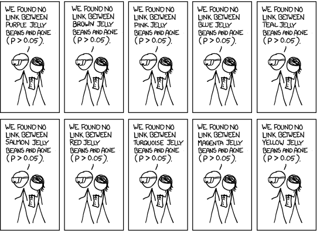
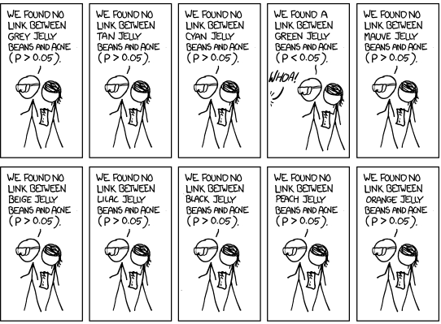
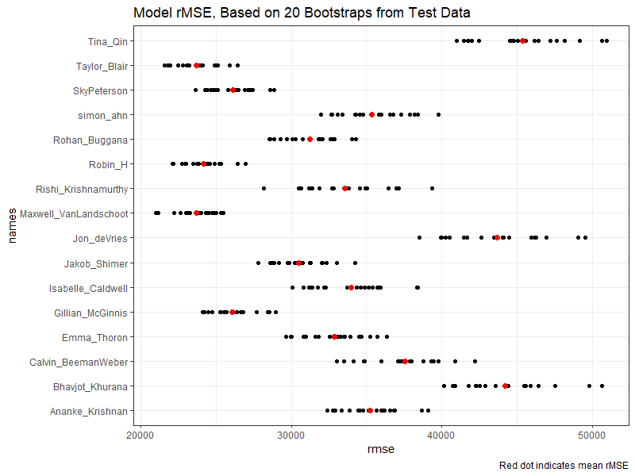
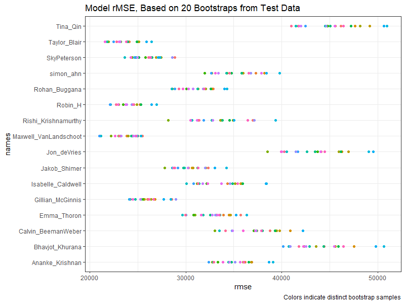

```{r setup, include=FALSE}
knitr::opts_chunk$set(
	echo = FALSE,
	fig.align = "center",
	message = FALSE,
	cache = F,
	fig.width = 6,
	fig.height = 4,
	warning = FALSE,
	out.width = "70%"
)
library(tidyverse)
library(knitr)
library(ggthemes)
library(ISLR)
```

## Outline

In today's class, we will...


- Investigate the relationship between selection bias and feature selection

- Discuss data from homework 3 (Ames House Prices)


# Selection Bias

## Inference?

Consider the `solubility` data contain chemical structure for 951 compounds.

```{r}
library(AppliedPredictiveModeling)
data(solubility)
solTest <- data.frame(solTestX, Solubility = solTestY)
solTrain <- data.frame(solTrainX, Solubility =  solTrainY)
solTest <- solTest %>% select(!starts_with("FP"))
solTrain <- solTrain %>% select(!starts_with("FP"))
```

- Suppose I use best subset selection and find that the best model has two variables:

\tiny

```{r}
small_mod <- lm(Solubility ~ MolWeight + NumCarbon, data = solTrain)
summary(small_mod)
```

\pause

\normalsize

- Can I conclude that `MolWeight` has a statistically significant linear relationship with `Solubility`, in the presence of `NumCarbon`, at the 0.001 level?

- Can I conclude that the $F$ test is statistically significant at the 0.001 level?

## The Problem of Multiple Comparisons

```{r fig.cap="https://xkcd.com/882"}

```

## The Problem of Multiple Comparisons

```{r}

```

## The Problem of Multiple Comparisons

```{r}

```


## The Problem of Multiple Comparisons

```{r}

```

## Feature Selection and Overfitting

- Feature selection algorithms must be considered as part of model building process.

  \pause

  - Performing feature selection can add considerable variability into model predictions.

  - Feature selection is extremely flexible, hence, very susceptible to overfitting. 
  
\pause

  - Consider: How would the results of the feature selection process change **if different training data were used**
  
\pause

- Feature selection gives woefully optimistic estimate of any error metric measured on training data.

  - What other model-building algorithm has this problem?
  
\pause

- The fix?

  \pause

  - Error estimates must be made using cross-validation and inference performed using bootstrapping.

  \pause

  - However, the **entire** feature selection process must be independently performed on each fold / bootstrap. 

## An Illustration of Resampling for Feature Selection

## Conclusions

Is automated feature selection worth it?


\pause

- Benefits:

  - Has intuitive appeal
  
  - In situations where prediction is goal, can *sometimes* lead to more accurate predictions (especially when combined with cross-validation)
  

  
\pause

- Drawbacks:

  - Yields overly optimistic $R^2$.
  
  - p-values reported are meaningless
  
  - prediction intervals are too narrow
  
  - **Very** unstable under collinearity
  
  - Model coefficients are often too high
  
  - Amplifies "regression to the mean" effect
  
  - There are other methods that perform feature selection without these problems

# Ames House Price Data

## Overview

- Students fit models of varying complexity based on data on 66 predictors for 1808 houses.

\pause

- Models were assesses by computing rMSE on a test set of 597 houses. 

- Additionally, to assess variability, rMSE was computed on 20 bootstrap samples from the test data.

\pause

- The median model rMSE was $\$32,916$.

- The median model standard deviation in rMSE on bootstrap samples was $\$2,409$.

\pause

- The lowest three model rMSE were 
\begin{center}
\begin{tabular}{cccc}
Name & Taylor & Maxwell & Robin \\ \hline
rMSE & $\$23,722$ & $\$23,920$ & $\$24,388$  \\
SD & $\$1,626$ & $\$1,823$ & $\$1,580$
\end{tabular}
\end{center}

## Results

```{r}

```

## Results

```{r}

```

## Retrospective

Trends:

\pause


- Models with more predictors tended to do better than models with fewer predictors

\pause

- Models with 0 interaction terms tended to do better than those with 1 interaction

\pause

- Models that transformed key predictors tended to do better than those that did not

\pause

- Performing log or root transformation moderately reduced test MSE

\pause

- The full model was near the front of the pack, while the simple model using just 1 predictor (`Gr_Liv_Area`) was at the back.

\pause

Further Investigation (Homework 5):

- Use `regsubsets` to assist with feature selection

- Use a cross-validation to assess and compare model performance


