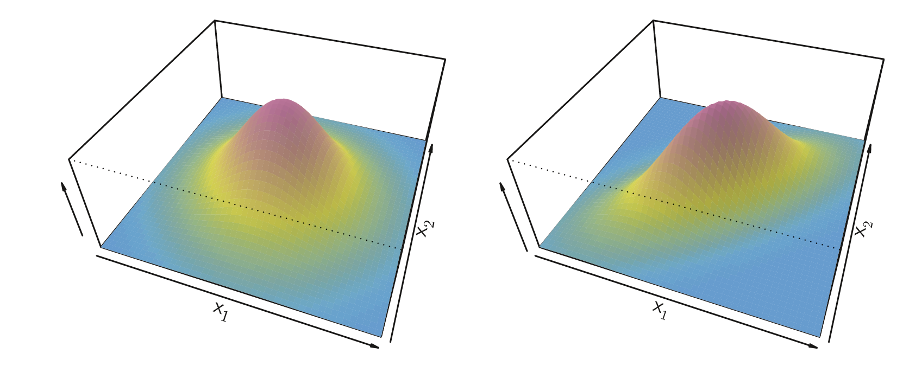
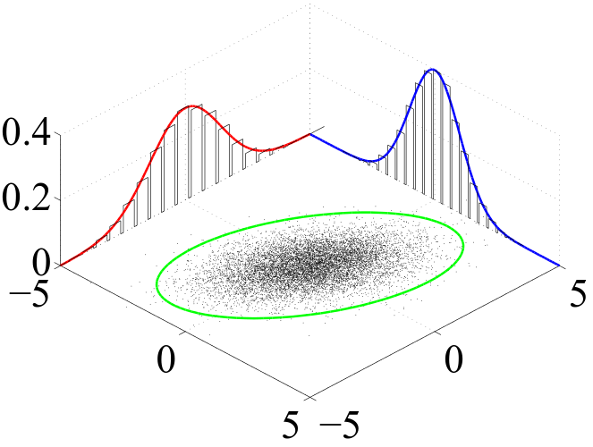

```{r setup, include=FALSE}
knitr::opts_chunk$set(
	echo = FALSE,
	fig.align = "center",
	message = FALSE,
	cache = F,
	fig.width = 6,
	fig.height = 4,
	warning = FALSE,
	out.width = "70%"
)
library(tidyverse)
library(knitr)
library(ggthemes)
library(ISLR)
library(ggforce) 
```

## Outline

In today's class, we will...

- Create a handmade LDA model

- Discuss LDA with two or more predictors

- Implement LDA in R

- Define QDA and compare to LDA

 


# Handmade LDA model
 

## LDA

Suppose $Y$ is a categorical variable with $\ell$ levels, and for each level $A_j$, that $$X|Y =A_j \sim N(\mu_j , \sigma).$$

\pause

The discriminant function
$$
\delta_j(x) = x \cdot \frac{\mu_{j}}{\sigma^2 } - \frac{\mu_j^2}{2\sigma^2} + \ln \pi_j
$$

can be used to classify an observation by choosing the level $A_j$ whose discriminant is largest at $x$.

\pause

We estimate the values of $\mu_j$ and $\sigma$ from the sample data:

$$\hat{\mu}_j = \frac{1}{n_j}\sum_{i:y_i = A_k}x_i$$

\pause 


$$\hat{\sigma}^2 = \frac{1}{n-\ell}\sum_{j=1}^\ell \sum_{i:y_i = A_k}(x_i - \hat{\mu_j})^2$$
  
## Simulated Data

Suppose $X  | Y = 0  \sim N(1,1)$ and $X  | Y = 1  \sim N(3,1)$, and that $\pi_0 = .75$ and $\pi_1 = .25$.

```{r}
set.seed(212)
n<-100

Y<-rep(c("0","1"), c(3*n/4, n/4))
X<-c(rnorm(3*n/4, 1, 1), rnorm(n/4, 3, 1) )

d<-data.frame(X,Y)
```

```{r out.width = "70%", cache=F}
mu0<-d %>% filter(Y == 0) %>% summarise(mu = mean(X) ) %>% pull()
mu1<-d %>% filter(Y == 1) %>% summarise(mu = mean(X) ) %>% pull()
ssx <- d %>% group_by(Y) %>% summarize(ssx = var(X) * (n() - 1), n()) %>% pull(2,)
sigma2 <- sum(ssx)/(n - 2)
density0 <- function(x){dnorm(x, mean = mu0, sd = sqrt(sigma2))}
density1 <- function(x){dnorm(x, mean = mu1, sd = sqrt(sigma2))}
pi0 <- sum(d$Y =="0")/n
pi1 <- sum(d$Y =="1")/n

d %>% mutate(y = 0) %>% 
ggplot(aes(x = X, color = Y) )+geom_jitter(aes(x= X, color = Y,y = y), alpha = .55, size = 2, height = .01)+geom_function(fun = density0, color = "salmon")+geom_function(fun = density1)+theme_bw()+labs(y = "density")
```
\pause

- What feature of the graph shows that $\pi_0 = .75$ and $\pi_1 = .25$?


## Find Estimates
 

Estimates for $\mu_j$ and $\pi_j$

\small
```{r echo = T}
d %>% group_by(Y) %>% summarize(pi = n()/n, mu = mean(X))
```

\pause

\normalsize

Estimate for $\sigma^2$.

\small

```{r echo = T}
d %>% group_by(Y) %>% summarize(ssx = var(X) * (n() - 1)) %>%
  summarize(sigma_sq = sum(ssx)/(n-2))
```

## The discriminant function

Solve for intersection of discriminant functions: $\delta_0 (c) = \delta_1(c)$ when

\pause

$$
c = \frac{\mu_0 + \mu_1}{2} + \frac{ \sigma^2 (\ln \pi_0 - \ln \pi_1) }{ \mu_1 - \mu_0}
$$


\pause
\small
```{r echo = T}
c<- (mu0 + mu1)/2 + (sigma2*log(pi0) - log(pi1))/(mu1-mu0)
c
```
\pause

\normalsize

Write a function to create discriminant functions:
\small
```{r echo = T}
discriminant <- function(x, pi, mu, sigma2) {
  x * (mu/sigma2) - (mu^2)/(2 * sigma2) + log(pi)
}
```

\normalsize
\pause

Evaluate discriminant function on data for each class:

\small
```{r echo=T}
d0 <- discriminant(d$X, pi0, mu0, sigma2)
d1 <- discriminant(d$X, pi1, mu1, sigma2)
```


## Plots

```{r warning = F, fig.height = 2.25}

discriminant_data <- data.frame(d, d0,d1, y = 0)

ggplot(discriminant_data) + 
  geom_jitter(aes(x = X, y = 0, color = Y), height = .15,alpha = .55, size = 2)+
  geom_line(aes(x = X, y = d0), color = "salmon", size = 1)+
  geom_line(aes(x = X, y = d1), color = "darkturquoise", size= 1)+
  geom_vline(xintercept = c , color = "purple", linetype = "dashed")+
  theme_bw()+ylim(-1,NA)+
  labs(x = "X", y = "discriminant")+
  annotate(geom = "text", x = 3, y = 6, label = "c = 2.48", color = "purple", size = 3)
```

```{r  fig.height = 2.25}
d %>% mutate(y = 0) %>% 
ggplot(aes(x = X, color = Y) )+geom_jitter(aes(x= X, color = Y,y = y), alpha = .55, size = 2, height = .01)+geom_function(fun = density0, color = "salmon")+geom_function(fun = density1)+theme_bw()+labs(y = "density")+geom_vline(xintercept = c , color = "purple", linetype = "dashed")
```

\pause

- Why don't discriminant functions intersect at the same point as density curves?

# LDA with multiple predictors


## Multivariate Gaussian Distributions

A vector $X = (X_1, X_2, \dots , X_p)$ is said to have multivariate gaussian distribution if all linear combinations of coordinates $a1 X_1 + a_2 X_2 + \dots + a_p X_p$ have a Normal distribution.

\pause

A multivariate gaussian distribution is specified by mean vector $\mu = (\mu_1, \mu_2, \dots, \mu_p)$ and covariance matrix 
\small
$$
\Sigma  = \begin{pmatrix} \mathrm{Var}(X_1) & \mathrm{Cov}(X_1, X_2) & \cdots & \mathrm{Cov}(X_1, X_p) \\ 
\mathrm{Cov}(X_2, X_1) & \mathrm{Var}(X_2) & \cdots & \mathrm{Cov}(X_2, X_p) \\
\vdots & & \ddots & \vdots \\
\mathrm{Cov}(X_p, X_1) & \mathrm{Cov}(X_p, X_2) & & \mathrm{Var}(X_p) \end{pmatrix}
$$
\normalsize

\pause

The multivariate Gaussian density $f$ on $x \in \mathbb R^p$ is
$$
f(x) = \frac{1}{(2 \pi)^{p/2} (|\mathrm{det}\Sigma |)^{1/2}} \exp\Big( - \frac{1}{2}(x - \mu)^T \Sigma^{-1} ( x - \mu)\Big)
$$

```{r out.width="60%", echo = F, eval = F}

```

## Multivariate Scatterplot


```{r out.height="5in"}

```


## LDA with multiple predictors

Suppose that $Y$ is categorical with $\ell$ levels and that $X = (X_1, \dots, X_p)$ are a vector of predictors. Assume that $X | Y = A_j \sim N( \mu_j, \Sigma)$ with conditional density $f_j$, where $\Sigma$ is common to all conditional densities.

\pause

As before, we consider the log-likelihood ratio: 

$$
\ln \frac{P(Y = A_j \, | \,X = x  )}{P(Y = A_k \, | \, X = x  )} = \ln \frac{f_j(x) \pi_j }{f_k(x) \pi_k}
$$

\pause

The discriminant function $\delta_j(x)$ for $x \in \mathbb{R}^p$ is
$$
\delta_j(x) = x^T \Sigma^{-1} \mu_j - \frac{1}{2} \mu_j^T \Sigma^{-1} \mu_j + \ln \pi_j
$$

\pause

We classify a point $x$ by assigning it to the level with largest discriminant function at $x$.

\pause

Decision boundaries are given by solving for intersections of the $\binom{p}{2}$ pairs of discriminant functions:

$$
x^T \Sigma^{-1} \mu_j - \frac{1}{2} \mu_j^T \Sigma^{-1} \mu_j + \ln \pi_j = x^T \Sigma^{-1} \mu_k - \frac{1}{2} \mu_k^T \Sigma^{-1} \mu_k + \ln \pi_k
$$

# LDA in R

## Classification

- The `penguins` data set from the `palmerpenguins` package collected by Dr. Kristen Gorman on several attributes of antarctic penguins:

\pause

\tiny

```{r message = F, echo = T, warning = F}
library(palmerpenguins)
penguins <- penguins %>% drop_na()
glimpse(penguins)
```
 
```{r echo = T}
library(rsample)
set.seed(115)
penguins_split <- initial_split(penguins , strata = species)
penguins_train <- training(penguins_split)
penguins_test <- testing(penguins_split)
```


## Penguins Plot

- Can we classify `species` based on `body_mass_g` and `flipper_length_mm`?

```{r}
ggplot(penguins_train, aes( x = flipper_length_mm, y = body_mass_g, color = species))+geom_point(alpha = .75) + theme_bw()
```

Where should we place our **linear** decision boundaries?

 

## LDA in R

It would be tedious to compute LDA discriminant functions by hand. So we use the `lda` function in the `mass` package.

\footnotesize

```{r echo = T}
library(MASS)
penguin_lda <- lda(species ~ flipper_length_mm + body_mass_g,data = penguins_train)
```

\pause

\normalsize

- The `lda` function creates an LDA model which can be used to `predict`. It also has the following useful elements.

  - `prior`, the prior probabilities used (defaults to class proportions in training data)
  
  - `means`, means for predictors within each group
  
\pause

\footnotesize

```{r echo = T}
penguin_lda$prior
penguin_lda$means
```
## Predictions

- The `mass` package has a `predict` function for `lda`, which creates a list with two objects:

  - `class`, the predicted class for each observation
  
  - `posterior`, the posterior probabilities for each class

\footnotesize

\pause

```{r}
lda_pred <- predict(penguin_lda, penguins_test)$class
head(lda_pred)

lda_probs <- predict(penguin_lda, penguins_test)$posterior
head(lda_probs)
```

## Error Rate

How well does LDA do?

\footnotesize

\pause
```{r}
library(yardstick)
lda_results <- data.frame(obs = penguins_test$species, preds = lda_pred)
conf_mat(lda_results, truth = obs, estimate = preds)
```

\pause

\normalsize

- It looks like the model had some trouble distinguishing between Adelie and Chinstrap penguins.

\small
```{r echo = T}
accuracy(lda_results, truth = obs, estimate = preds)
```


## Penguin Decision Boundaries

```{r}
contour_data <- expand.grid(body_mass_g = seq(min(penguins_train$body_mass_g), max(penguins_train$body_mass_g), length = 300),
  flipper_length_mm = seq(min(penguins_train$flipper_length_mm), max(penguins_train$flipper_length_mm), length = 300))

new_lda_predict <- data.frame(contour_data, species=as.numeric(predict(penguin_lda, contour_data)$class))

p2 <- ggplot(data=penguins_train, aes(x = flipper_length_mm, y = body_mass_g)) + 
  geom_point(aes(col=species), alpha =.75) +
  stat_contour(aes(x=flipper_length_mm, y=body_mass_g, z=species), data=new_lda_predict, 
               col = 1, lineend = "round") +
  theme_bw()

p2
```

# QDA 

## Generalized Model

For a data set with $15$ predictors and $1000$ observations, would you be more worried about bias (Y) or variance (N) for an LDA model?

\pause

- With lots of data, variance is likely low. But the modeling restrictions of LDA might make bias problematic. 

\pause

- We might be able to improve MSE by considering a more **complex** model.

\pause

One underlying assumption for LDA was that all conditional distribution of predictors $P(X = x \, | \, Y = y_j)$ had the same variance (or covariance matrix, for $p \geq 2$).

\pause

Lifting this restriction leads to **Quadratic Discriminant Analysis** (QDA)

## QDA

Suppose that $Y$ is categorical with $\ell$ levels and that $X = (X_1, \dots, X_p)$ are a vector of predictors. Assume that $X | Y = A_j \sim N( \mu_j, \Sigma_j)$ with conditional density $f_j$.

\pause

As with LDA, we consider the log likelihood ratios
$$
\ln \frac{P(Y = A_j \, | \,X = x  )}{P(Y = A_k \, | \, X = x  )} = \ln \frac{f_j(x) \pi_j }{f_k(x) \pi_k}
$$

\pause

But now when we substitute the formula for multivariate densities $f_i$, the variance (or covariance) terms in numerator and denominator do **not** cancel. 

\pause

This leads to the QDA discriminant function $\delta_j(x)$:

$$
\delta_j(x) = - \frac{1}{2} x^T \Sigma^{-1}_j x +  x^T \Sigma^{-1}_j \mu_j - \frac{1}{2} \mu_j^T \Sigma^{-1}_j \mu_j - \frac{1}{2} \ln \det \Sigma_j +  \ln \pi_j
$$

\pause 

Which simplifes to the following when $p = 1$:

$$
\delta_j(x) = - x^2\frac{1}{2 \sigma_j} +  x\frac{\mu_j}{\sigma_j}  - \frac{\mu_j^2}{2 \sigma_j} - \frac{1}{2} \ln \sigma_j +  \ln \pi_j
$$

## In R

We use the `qda` function in the `mass` package.

\small

```{r echo = T}
library(MASS)
penguin_qda <- qda(species ~ flipper_length_mm + body_mass_g,data = penguins_train)
penguin_results <- data.frame(obs = penguins_test$species,
                              preds = predict(penguin_qda, penguins_test)$class)
conf_mat(penguin_results, truth = obs, estimate = preds)
```

\pause

How did we do?

\small
```{r echo = T}
accuracy(penguin_results, truth = obs, estimate = preds)
```

## QDA Decision Boundaries

```{r}
new_qda_predict <- data.frame(contour_data, species=as.numeric(predict(penguin_qda, contour_data)$class))

p3 <- ggplot(data=penguins_train, aes(x = flipper_length_mm, y = body_mass_g)) + 
  geom_point(aes(col=species), alpha =.75) +
  stat_contour(aes(x=flipper_length_mm, y=body_mass_g, z=species), data=new_qda_predict, col = 1) +
  theme_bw()

p3

```


## LDA - QDA Comparison

```{r}
p4 <- ggplot(data=penguins_train, aes(x = flipper_length_mm, y = body_mass_g)) + 
  geom_point(aes(col=species), size = 2, alpha = .75) +
  stat_contour(aes(x=flipper_length_mm, y=body_mass_g, z=species), data=new_qda_predict, col = 1) +  stat_contour(aes(x=flipper_length_mm, y=body_mass_g, z=species), data=new_lda_predict, 
                lineend = "round",  color = "purple" )+
  theme_bw()

p4

```


