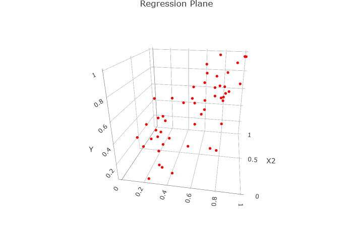

```{r setup, include=FALSE}
knitr::opts_chunk$set(echo = FALSE, fig.align = "center", message = F, cache = T)
library(tidyverse)
library(knitr)
library(ggthemes)
library(moderndive)
library(ISLR)
```

## Outline

In today's class, we will...

 


- Generalize the simple regression model to include more than 1 predictor

- Quantify model accuracy for linear regression models (both simple and multiple)

- Implement multiple regression in R
 

# Multiple Regression
 
## Many Simple Linear Regression Models?

We are often presented situations where several explanatory variables could be used to predict values of a single response variable.


\pause


  -    **Response**: Home price
  -    **Predictors**: square feet, number of bedrooms, number of bathrooms
  
\pause


  -    **Response**: Professor age in photo
  -    **Predictors**: number of static lines, proportion gray hair, skin laxity
  
\pause

In each case, we could create simple linear regression models for each predictor variable. 

  \pause
  
  - But its not clear how to combine estimates from multiple models.

  \pause
  
  - The results may be misleading. Several explanatory variables may be highly correlated.
  
  \pause
  
  - And even if none of the predictors have strong association with the response, it is likely we will observe a significant predictor just due to chance.
  
  \pause
  
Could we get better predictive power by including all explanatory variables in the *same* model?


## Multiple Regression Model

In a **simple linear regression model** (SLR), we express the response variable $Y$ as a linear function $f$ of one predictor variable $X$:
$$Y = f(X) + \epsilon $$

and estimate $f$ using 

$$\hat{Y} = \hat{f}(X) = \hat{\beta}_0 + \hat{\beta}_1   X  $$

\pause

In a **multiple linear regression model** (MLR), we express the response variable $Y$ as a linear combination $f$ of $p$ predictors $X_1, X_2, \dots , X_p$:
$$Y = f(X_1, \dots, X_p) + \epsilon $$
and estimate $f$ using 
$$\hat{Y}  =  \hat{f}(X_1, \dots, X_p) = \hat{\beta}_0 + \hat{\beta}_1 X_1 + \hat{\beta}_2  X_2 + \dots + \hat{\beta}_p  X_p$$

\pause

- In the MLR model, we allow predictors to either be quantitative or binary categorical (i.e taking values 0 or 1 corresponding to failure or success)


## Finding Parameters

To create an SLR model, we found the equation of a line that minimizes RSS, where
$$\textrm{RSS} = \sum_{i=1}^n (y_i - \hat{y}_i)^2   = \sum_{i=1}^n (y_i - \hat{\beta}_0 - \hat{\beta}_1 x_1),$$
which has the solution
$$
\hat{\beta}_1  = \frac{\sum_{i=1}^n (x_i - \bar{x})(y_i - \bar{y})}{\sum_{i=1}^n (x_i - \bar{x})^2} \qquad \hat{\beta}_0 = \bar{y} - \hat{\beta}_1 \bar{x}
$$

\pause

And in R, we computed the coefficients using

\small

```{r eval=F, echo = T}
my_mod<-lm(Y ~ X, data = my_data)
summary(my_mod)
```

\pause

To create an MLR model... 

\pause
\phantom{space space} we do the exact same thing!

## Finding Parameters MLR
To create a MLR model, we find the equation of a **hyperplane** in $\mathbb{R}^{p+1}$ that minimizes RSS, where
$$\textrm{RSS} = \sum_{i=1}^n (y_i - \hat{y}_i)^2 = \sum_{i=1}^n (y_i - \hat{\beta}_0 - \hat{\beta}_1 x_1 - \dots -  \hat{\beta}_p x_p)^2,$$
which has the solution
$$
\hat{\beta} = (\mathbf{X}^T \mathbf{X})^{-1} \mathbf{X}^T \mathbf{y}
$$

  - $\hat \beta$ is the $(p+1)$-vector of coefficient estimates $(\hat \beta_0, \hat \beta_1, \dots, \hat \beta_p)$
  
  - $\mathbf y$ is the $n$-vector of observed responses
  
  - $\mathbf{X}$ is the $(n \times p+1)$-matrix (or dataframe) consisting of $n$ rows of observations on $p$ predictors (plus a column of 1's).
  
  \pause
  
  - If we have 2 predictors, the equation describes a plane in 3D space.
  
\pause 

We even use the exact same R code to fit the linear model:

\small

```{r eval=F, echo = T}
my_mod<-lm(Y ~ X1 + X2 + ... + Xp, data = my_data)
```

## The Plane of Best Fit

\columnsbegin
\column{.45\textwidth}
```{r}

```

\column{.45\textwidth}

```{r}
include_graphics("img/3dplot_plane.png")
```

\columnsend


An interactive graphic available under topics for Wednesday 9-15 on schedule page of course website

## Example: Credit Card Debt

The `Credit` dataset in the `ISLR` package contains (fabricated) credit card debt and other financial and demographic information for 400 individuals.

\pause

**Goal**: Build a model that allows us to predict credit debt given financial and demographic information

\pause 

We first consider `balance` as a function of `credit_limit` and `income`

\pause

\columnsbegin
\column{.45\textwidth}
\fontsize{7pt}{7.2}\selectfont
```{r echo = F, out.width="90%"}
Credit %>% ggplot(aes( x = Limit, y = Balance))+
  geom_point()+
  geom_smooth(method = "lm", se = F)+
  labs(x = "Credit Limit (in $)", y = "Debt (in $)", title = "Debt and Limit")
```

```{r echo=F, eval=F}
dept_limit_mod<-lm( Balance ~ Limit, data = Credit)
get_regression_table(dept_limit_mod)
```

$$R = 0.86 \qquad \hat{Debt} = -292.8 + 0.17 \cdot \textrm{Limit}$$
\column{.45\textwidth}
\fontsize{7pt}{7.2}\selectfont

\pause

```{r echo = F, out.width="90%"}
Credit %>% ggplot(aes( x = Income, y = Balance))+
  geom_point()+
  geom_smooth(method = "lm", se = F)+
  labs(x = "Income (in $1000)", y = "Debt (in $)", title = "Debt and Income")
```

```{r echo=F, eval=F}
dept_income_mod<-lm( Balance ~ Income, data = Credit)
get_regression_summaries(dept_income_mod)
```

$$R = 0.46 \qquad \hat{Debt} = 246.51 + 6.048 \cdot \textrm{Income}$$
\columnsend

\pause

Both variables have some explanatory power for Debt.


## The Regression Plane


How do Limit and Income *together* explain Debt?
\pause

```{r echo=F, out.width="65%"}
include_graphics("img/ccplane.png")
```


## Multiple Regression for Debt

Let's find the MLR model

\fontsize{7pt}{7.2}\selectfont
```{r echo = T}
mod<-lm(Balance ~ Limit + Income, data = Credit)
```
\fontsize{9pt}{7.2}\selectfont

\pause

And investigate the regression table

\fontsize{7pt}{7.2}\selectfont
```{r echo = T}
summary(mod)$coefficients
```
\fontsize{9pt}{7.2}\selectfont

\pause

Which gives us the regression equation:

$$\hat{Debt} = -385.179 + 0.264 \cdot \textrm{Limit} - 0.7663 \cdot \textrm{Income}$$

\pause
- For **fixed** value of Income, increasing Credit Limit by $\$1$ increases debt by an average of $\$0.264$.

\pause

- While for **fixed** value of Limit, increasing Income by $\$1000$ decreases debt by an average of $\$7.66$.
 


## Comparing MLR and SLR

Wait...

\pause

- The SLR for Debt and Income was
$$\hat{Debt} = 246.51 + 6.048 \cdot \textrm{Income}$$

\pause 

  - That is, increasing Income by $\$1000$ **INCREASED** debt by $\$6.05$. 
  
\pause

- But the MLR is 

$$\hat{Debt} = -385.179 + 0.264 \cdot \textrm{Limit} - 0.7663 \cdot \textrm{Income}$$

\pause

- Not only has MLR given us a new rate of change, but it's completely switched the direction!

\pause

- How is this possible?

## Income and Credit Limit

Let's consider the relationship between income and credit limit

\pause 
```{r echo = F, out.width="45%"}
Credit %>% ggplot(aes( x = Income, y = Limit))+
  geom_point()+
  geom_smooth(method = "lm", se = F)+
  labs(x = "Income (in $1000)", y = "Credit Limit (in $)", title = "Income and Credit Limit")+
  annotate(geom = "text", x = 50, y = 12000, label = "Y = 2390  + 52 X")+
  annotate(geom = "text", x = 50, y = 10000, label = "R = 0.8")
```

```{r echo=F, eval=F}
limit_income_mod<-lm( Limit ~ Income, data = Credit)
get_regression_table(limit_income_mod)
```
\pause

In a vacuum, as income increases, so too does credit limit. 

  \pause
  
- So in the SLR model, when we assess the change in Debt due to increase in Income, we are implicitly also increasing Credit Limit

  \pause

  - We could say Credit Limit is a confounding variable in the SLR model.
  
\pause

## The Regression Plane Revisited

In the MLR model, we may freely change both Income and Credit Limit

  \pause
  
  - This corresponds to the fact that there is a unique Debt point on the regression plane for each pair of Income / Credit Limit values.
  
\pause

```{r echo=F, out.width="60%"}
include_graphics("Img/ccplane.png")
```

## Debt vs. Income Revisited

We can lump Credit Limits into 4 brackets (low, med-low, med-high, high) to create a categorical variable and analyze the SLR for Debt and Income for each level of Credit Limit

\pause

```{r echo = F, out.width="70%"}
Credit_bracket<-Credit %>% mutate(credit_bracket = ifelse(
  Limit < 3088, "low", ifelse(
    Limit > 3088 & Limit < 4622, "med-low", ifelse(
      Limit > 4622 & Limit < 5874, "med-high", "high"
    )
  )
)) %>% mutate(credit_bracket = fct_relevel(credit_bracket, "high", "med-high", "med-low", "low"))

Credit_bracket %>% ggplot(aes( x = Income, y = Balance, color = credit_bracket))+
  geom_point()+
  geom_smooth(method = "lm", se = F)+
  labs(x = "Income (in $1000)", y = "Debt (in $)", title = "Debt and Income")+geom_smooth(color = "steelblue", alpha = .25 , aes(x = Income, y = Balance), method = "lm", se = F)
```

# Assessing Model Accuracy

## How Strong is a Linear Model?

- In an linear model model, $$Y = f(X)+ \epsilon $$ So even if we could perfectly predict $f$ using $\hat{f}$, our model would still have non-zero MSE. 

\pause
 
- The **Residual Standard Error** (RSE) measures the average size of deviations of the response from the linear regression line. It is given by

$$\mathrm{RSE} = \sqrt{\frac{1}{n- 1 - p}\mathrm{RSS} } = \sqrt{\frac{1}{n- 1 - p} \sum_{i =1}^n (y_i - \hat{y}_i)^2} $$

\pause

- It has the property that

$$E(\mathrm{RSE}^2 ) = \mathrm{Var}(\epsilon)$$
  
  - Which means that $E(\mathrm{RSE}) \approx \mathrm{sd}(\epsilon)$


## Five Flavors of Error

Which of the following are most likely to decrease as more and more predictors are added to a linear model (select all that apply)?

(a) test MSE
(b) training MSE
(c) RSS
(d) RSE
(e) $\mathrm{Var}(\epsilon)$


## The $R^2$ statistic

Large RSE indicates poor model fit, while small RSE indicates good fit. But how do we determine how small is **small**?

  \pause
  
  - The answer depends on the units of $Y$
  
\pause

An alternative, standardized measure of goodness of fit is the $R^2$ statistic:
$$
R^2 = 1 - \frac{\mathrm{RSS}}{\mathrm{TSS}} \qquad \textrm{ where } \mathrm{TSS} = \sum_{i=1}^n (y_i - \bar{y})^2
$$

\pause

- The value of $R^2$ is always between $0$ and $1$, and represents the percentage of variability in values of the response just due to variability in the predictors.

## Values of R^2

If $R^2 \approx 1$: nearly all the variability in response is due to variability in the predictor variable.
  
  \pause
  
  
```{r echo = F, out.width="55%"}

set.seed(254)
X<-runif(20, 1, 4)
Y<-X + rnorm(20,0,0.2)

dd<-tibble(X,Y)

ggplot(dd )+
  geom_point( aes(x = X, y =Y))+
  geom_point( aes( x = 0, y = Y), color = "darkgrey")+
  geom_point( aes( x = X, y = 0),color = "darkgrey")+
  annotate(geom = "text", x = 1, y = 3, label = "R = 0.97")+
  annotate(geom = "text", x = 1, y = 2.5, label = "R^2 = 0.94")
```


## Values of $R^2$

If $R^2 \approx 0$: almost none of the variability in response is due to variability in the predictor variable.
  
  \pause
  
  
```{r echo = F, out.width="55%"}

set.seed(254)
X<-runif(20, 1, 4)
Y<- X/10+rnorm(20,0,1)

dd<-tibble(X,Y)

ggplot(dd )+
  geom_point( aes(x = X, y =Y))+
  geom_point( aes( x = 0, y = Y), color = "darkgrey")+
  geom_point( aes( x = X, y = 0),color = "darkgrey")+
  annotate(geom = "text", x = 1, y = 3, label = "R = 0.27")+
  annotate(geom = "text", x = 1, y = 2.5, label = "R^2 = 0.07")
```

## Formulas for $R^2$ in terms of correlation

For SLR, 
$$
R^2 = \left[ \mathrm{Cor}(X,Y)\right]^2 = \left[ \frac{\mathrm{Cov}(X,Y)}{\sqrt{\mathrm{Var}(X)\mathrm{Var}(Y) }} \right]^2= \left[ \frac{  \sum_{i=1}^n(x_i - \bar{x})(y_i - \bar{y})    }{\sqrt{ \sum_{i=1}^n(x_i - \bar{x})^2 } \sqrt{ \sum_{i=1}^n(y_i - \bar{y})^2 }} \right]^2
$$

\pause

For MLR,
$$
R^2 = \left[ \mathrm{Cor}(Y, \hat{Y}) \right]^2
$$

\pause

We will usually use software to compute $R^2$.

## Model Accuracy in `R`

\fontsize{7pt}{7.2}\selectfont
```{r echo = T}
mod_credit<-lm(Balance ~ Income + Limit , data = Credit)

summary(mod_credit)
```
\fontsize{9pt}{7.2}\selectfont

\pause

We can use `summary(mod)$r.sq` or `summary(mod)$sigma` to access $R^2$ and $\mathrm{RSE}$ directly.

## Adjusted $R^2$

- It turns out that the samples's $R^2$ gives a **biased** estimate of the variability in the *population* explained by the model.

\pause

- Instead, we use the adjusted R:
\fontsize{7pt}{7.2}\selectfont
$$R^2_{\mathrm{adjusted}} =   1 - \frac{\mathrm{RSS}}{\mathrm{TSS}} \frac{n-1}{n - p -1}$$

\pause

- This adjusted $R^2$ is usually a bit smaller than $R^2$, and the difference decreases as $n$ gets large.

## Testing Significance

Suppose we wish to test whether at least one predictor has a significant linear relationship with the response.

\pause

Why would it be incorrect to conduct $p$ many significant tests comparing each predictor to the response?


## The Hypothesis Test
Goal: test whether any predictors are significant.

\pause
Hypotheses:
$$H_0: \beta_ 1 = \dots = \beta_p = 0 \qquad H_a: \textrm{ at least one of } \beta_i \neq 0$$

\pause

Test statistic:
$$
F = \frac{(\mathrm{TSS} - \mathrm{RSS})/p}{\mathrm{RSS}/(n-p-1)}  
$$

\pause

Under the null hypothesis, $F$ is approximately $F$-distributed with $p,n-p-1$ parameters.

\pause

```{r fig.height=2, fig.width=6, out.width = "70%"}
X = seq(0,8, by = .1)
Y= df(X, 4, 20)
data.frame(X,Y) %>% 
  ggplot(aes(x= X, y = Y))+
  geom_line()+
  labs(title = "Density for 4 predictors, 25 observations", x = "F")
```

## Typical Values of the $F$ statistic

Provided conditions for linear regression are met, 
$$
E \left[ \frac{\mathrm{RSS}}{n - p - 1} \right] = \sigma^2 = \mathrm{Var}(\epsilon)
$$

\pause

And if $H_0$ is also true, then
$$
E \left[ \frac{\mathrm{TSS} - \mathrm{RSS}}{p} \right] = \sigma^2 = \mathrm{Var}(\epsilon)
$$

\pause

Hence, if there is truly no relationship between any of the predictors and the response, then
on average,
$$
F = \frac{(\mathrm{TSS} - \mathrm{RSS})/p}{\mathrm{RSS}/(n-p-1)} = 1
$$

\pause

Moreover, it is unlikely that $F$ is drastically larger than $1$.

## Poll 2: TSS and RSS

Suppose we have a linear model with $25$ observations and $4$ predictors. Which of the following provides the best evidence of a relationship between the response and at least 1 of the predictors?

(a) $\mathrm{TSS} = 64$, $\mathrm{RSS} = 4$
(b) $\mathrm{TSS} = 4$, $\mathrm{RSS} = 16$
(c) $\mathrm{TSS} = 48$, $\mathrm{RSS} = 8$
(d) $\mathrm{TSS} = 4$, $\mathrm{RSS} = 4$

## Improving Model Accuracy

What do we do when model accuracy is low (either high $\mathrm{RSE}$ or low $R^2$)?

\pause

- If some variables are strongly correlated, remove some redundant ones.

  \pause
  
  - This process is known as *backwards elimination*. 
  
  - Start with the full model, remove the variable with highest $p$-value, and refit. Continue to do so until accuracy ceases to improve.
  
\pause

- If $\epsilon$ is too large, add further variables.

  \pause
  
  - This process is known as *forward selection*. 
  
  - Start with the null model, create $p$ many SLR models (one for each predictor), and select the one with best accuracy. Repeat with this new model, creating $p-1$ two predictor models (one for each remaining predictor). Continue until accuracy ceases to improve.
  
\pause

- Is it possible that none of these models will have the best possible accuracy among all subsets of predictors?

  \pause
  
  - Yes. But we'll cover detailed model selection in Chapter 6.