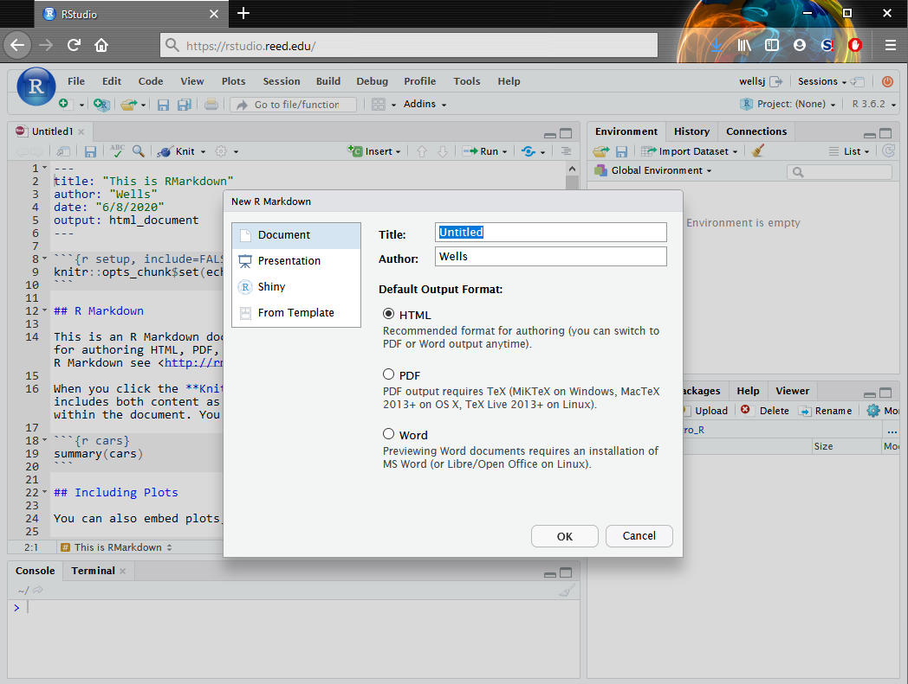
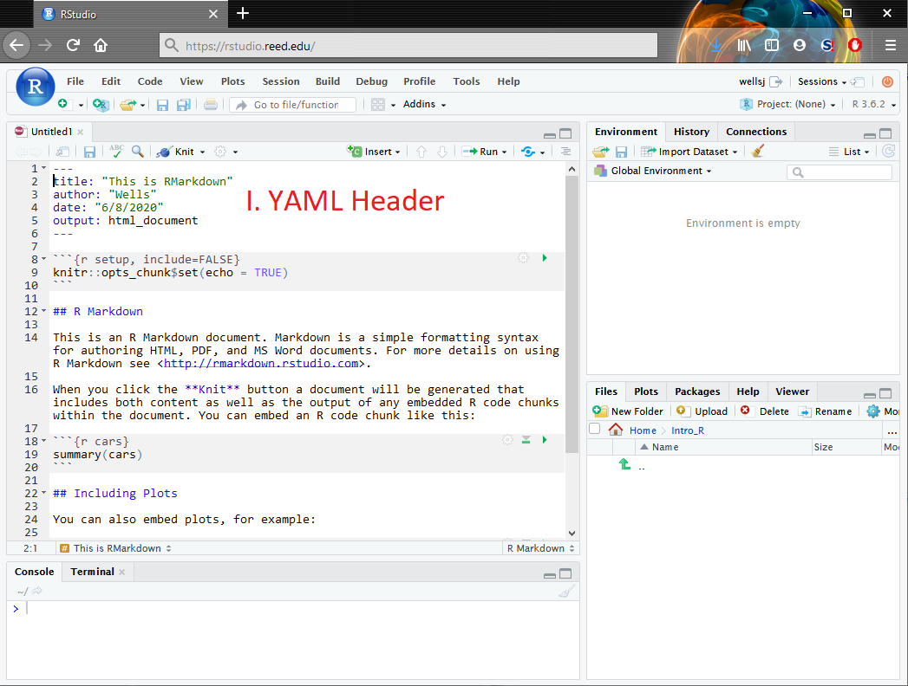
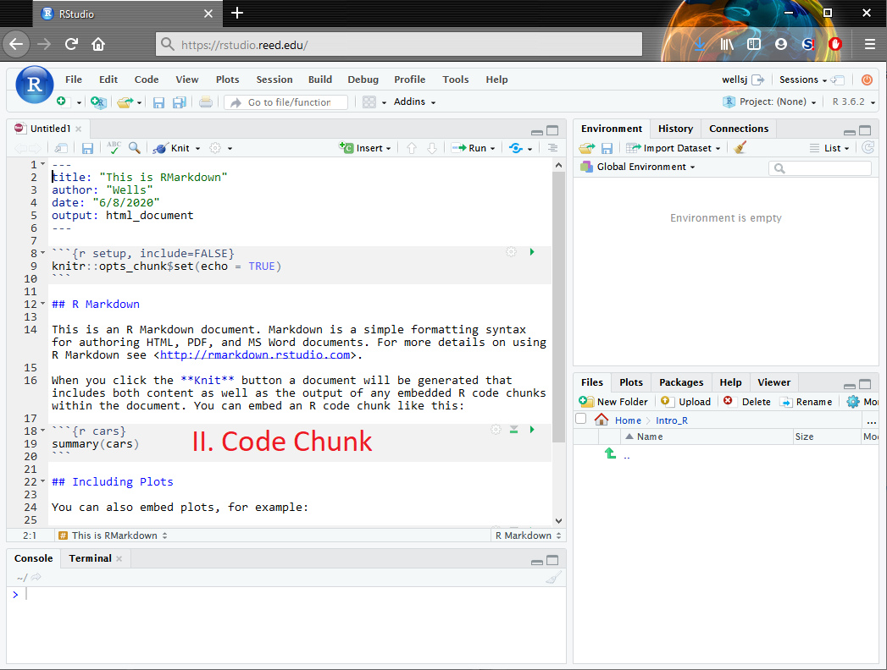
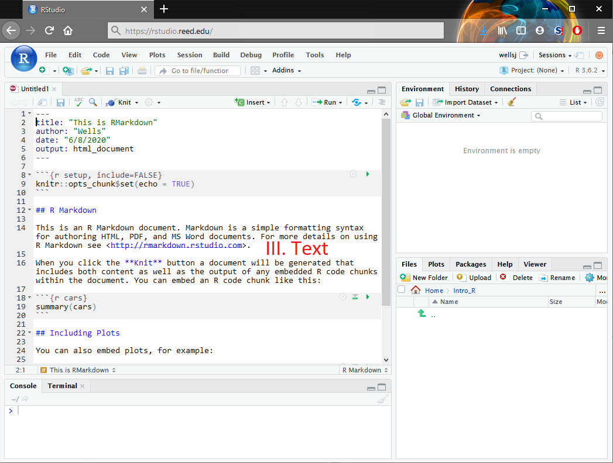
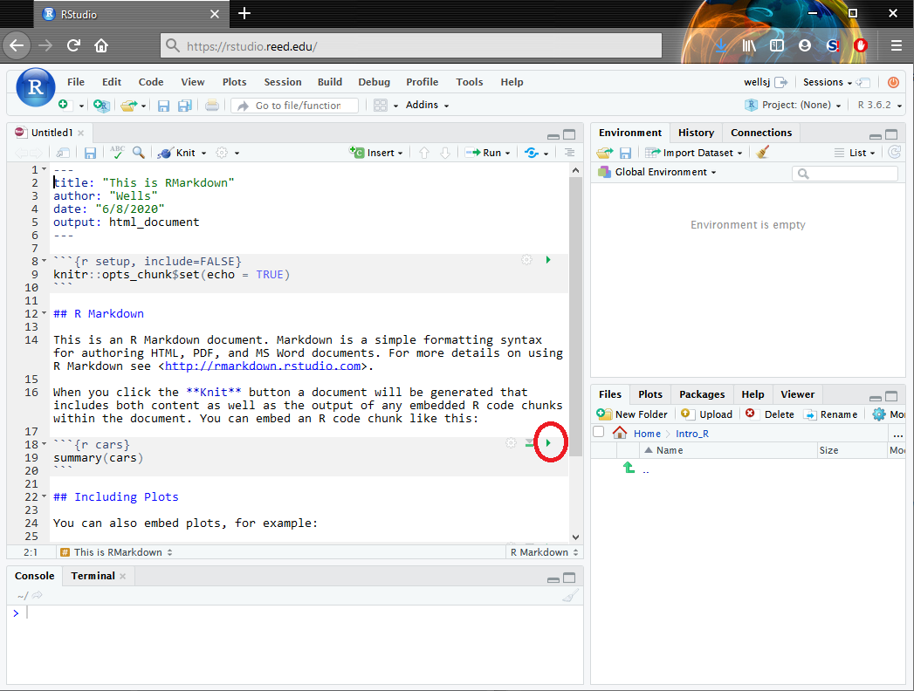
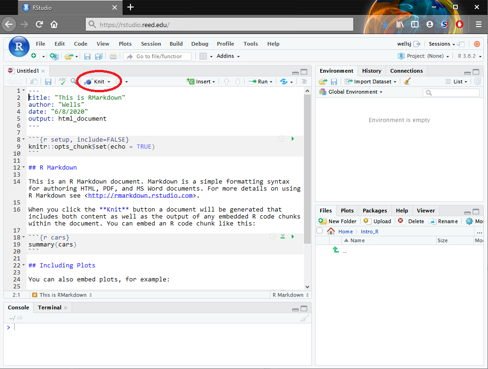
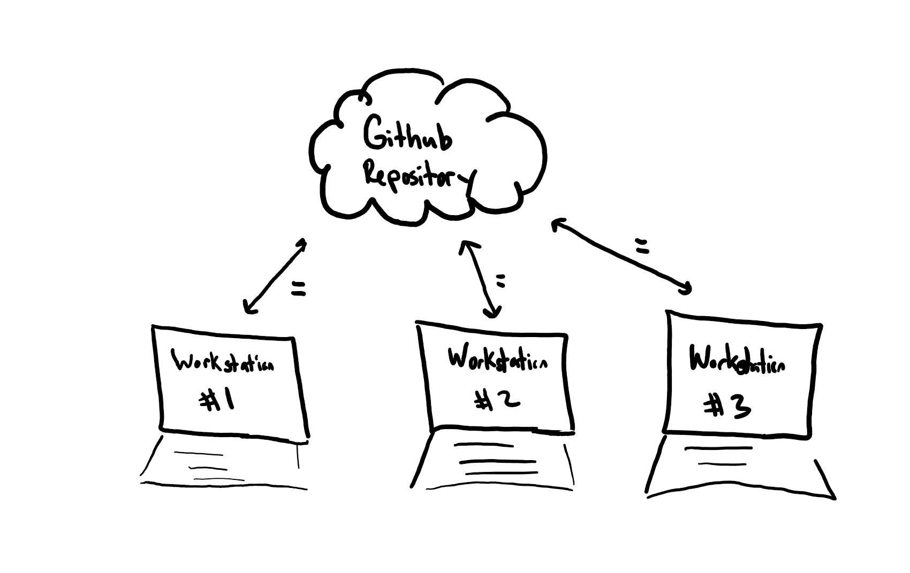
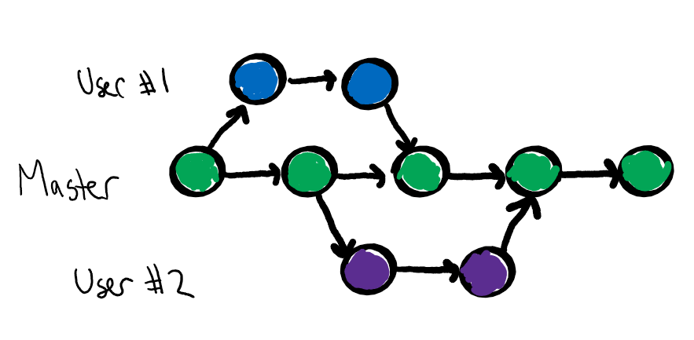

```{r setup, include=FALSE}
knitr::opts_chunk$set(echo = FALSE)
library(tidyverse)
library(knitr)
library(ggthemes)
```

## Outline

In today's class, we will...

\pause

- Explore the layout of Rstudio

\pause

- Discuss version control with GitHub

\pause

- Describe the typical GitHub workflow

\pause

- Practice cloning, pulling, committing, and pushing

# RStudio


## Using RStudio

- RStudio is a convenient interface for interacting with the R programming language

\pause

- The easiest way to access RStudio is via the Reed RStudio server:
\vspace{1em}

>https://rstudio.reed.edu

  
\pause

- It is also possible to install R and RStudio locally on your computer.

  \pause
  
  - Instructions: [https://www.reed.edu/data-at-reed/resources/R/installr.html](https://www.reed.edu/data-at-reed/resources/R/installr.html)
  
\pause

- Advantages of RStudio server.

  \pause
  
  - Accessible from any computer
  
  \pause
  - Avoid possibly messy installation
  
  \pause
  - Provides some storage space for files, data, and images
  
\pause

- Advantages of local installation

  \pause
  
  - Much more flexibility and customization
  
  \pause
  
  - Can be used after you graduate from Reed
  
## RMarkdown

- RStudio can also create and edit a special document type called **RMarkdown files** (.Rmd) which can seemlessly integrate code, results, and prose

\pause

- These features allow efficient generation of *reproducible* and *redistributable* results 

\pause

- RMarkdown can be used to create reports, assignments, journal articles, books, and presentations (like this one!)

\pause

- RMarkdown can output a variety of file types: .html, .pdf, .doc, and more
 

## New RMarkdown Files

- Open a new .Rmd file by selecting **File -> New File -> R Markdown** from the navigation bar at the top of the screen 

\pause

- You will be presented with a variety of options for output format and document type, but to begin, select "Document" and "pdf" output

\pause

```{r fig.align='center', out.width="55%" }

```

## Anatomy of RMarkdown

The standard .Rmd file contains three types of content

\pause

1. A YAML header surrounded by `---`

```{r fig.align='center', out.width="55%" }

```


## Anatomy of RMarkdown

The standard .Rmd file contains three types of content


2. **Chunks** of R code surrounded by ` ``` `

```{r fig.align='center', out.width="55%" }

```


## Anatomy of RMarkdown

The standard .Rmd file contains three types of content


3. Text formatted with simple markdown syntax like `*italics*` or `**bold**`

```{r fig.align='center', out.width="55%" }

```

## Using RMarkdown

- Clicking the little green arrow in the upper right corner of a code chunk sends the code to the console (just like selecting "run" on an R script)

\pause

```{r fig.align='center', out.width="55%" }

```

## Using RMarkdown

- Alternatively, to generate the output document, select "Knit" at the top of the Editor pane (This is similar to building a .pdf file using LaTeX)

\pause

```{r fig.align='center', out.width="55%" }

```


# Version Control

## What is version control?

- Git is one of the most popular version control systems, used by programmers, statisticians, data scientists and more!

\pause

- Git tracks the evolution of a document (and its file system) through a series snapshots (called **commits**)

\pause

- These commits make it easier to save and compare different versions of a document, as well as to restore a previous version

\pause

- Collaborators work independently on their version of the document, and then sync regularly to a common version


## Why version control?

There two main reasons you may want to use version control:

1. **Individual Use**. You have a document you will iterate on frequently, that references several other images and/or data sets, or that you want available on multiple devices

\vfill 

```{r fig.align='center', out.width="55%" }

```

## Why version control?

There two main reasons you may want to use version control:

2. **Group Use**. You are collaborating with several other people on a common document, need to synthesize several versions of the document, and comment on changes.

\vfill 
```{r fig.align='center', out.width="55%" }

```

## How to version control?

- We will use GitHub (an online interface and storage space for using git) for version control

  \pause

  - Think of GitHub as a shared google drive
  
\pause

- Files are stored on GitHub in **respositories** (a nested set of folders)

\pause

- Several ways to interact with Github:

  \pause

  - Upload/download to GitHub using the web interface (not recommended)

  \pause 

  - Issue commands in the shell (powerful, but steep learning curve)

  \pause

  - Use a client, like RStudio or GitHub Desktop (recommended)

## GitHub Workflow

1. Users **clone** the respositories from GitHub to their computer (or to the RStudio server).

  \pause

2. If the user has already cloned the repo previously, they instead **pull** any commits from the repo to their machine.
  

\pause


3. Then, users revise their documents as usual.

\pause

4. Occasionally, the user makes a **commit** of their work.

\pause

5. After making several commits (and especially when done working for the session), the user will **push** the commits to the GitHub repository.

# Practice

## Working Solo

Follow the instructions on the Working Solo document found under today's class (Wed 9-1) on the schedule page of the course website.

# Homework

## GitHub Classroom

We will use [GitHub Classroom](https://classroom.github.com/classrooms/69487382-reed-stat-learning-fall-2020-classroom) to distribute and submit homework for this course

\pause

1. To obtain each homework assignment, use that assignment's link posted in the #annoucements channel on Slack (since anyone with the link can create an assignment, the link won't be posted on the course website)

\pause

2. Follow the instructions on the page to create your own repo for that assignment in our Math 243 organization.

\pause

3. Clone the repo either to the RStudio server or your computer (following similar steps to the *Working Solo* activity)

\pause

4. Work on the assignment on the server or on your computer, making frequent commits. 

\pause

5. When you are finished working, push your commits to repo on GitHub organization. Congrats, you've submitted your assignment! (Note: if you don't push, your work will not be available to the grader)

\pause

6. You will receive feedback on the assignment via Pull Request (to be discussed later)
 


