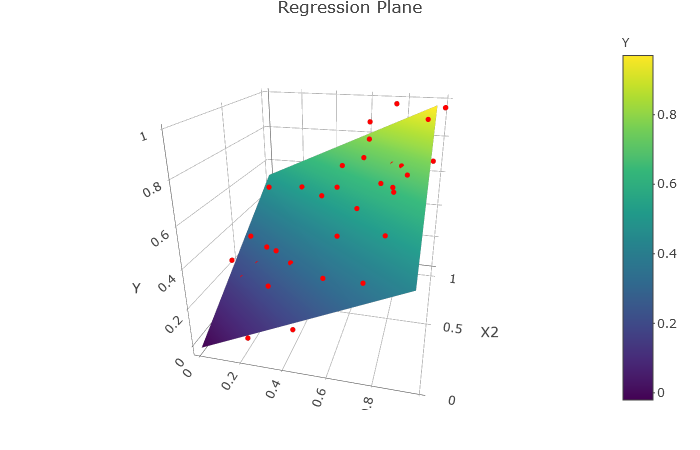

```{r setup, include=FALSE}
knitr::opts_chunk$set(
	echo = FALSE,
	fig.align = "center",
	message = FALSE,
	cache = TRUE,
	fig.width = 6,
	fig.height = 4,
	warning = FALSE
)
library(tidyverse)
library(knitr)
library(ggthemes)
library(moderndive)
library(ISLR)
```

## Outline

In today's class, we will...


- Quantify model accuracy for linear regression models (both simple and multiple)

- Troubleshoot potential problems with the linear model
  

# Assessing Model Accuracy

## How Strong is a Linear Model?

- In an linear model model, $$Y = f(X)+ \epsilon $$ So even if we could perfectly predict $f$ using $\hat{f}$, our model would still have non-zero MSE. 

\pause
 
- The **Residual Standard Error** (RSE) measures the average size of deviations of the response from the linear regression line. It is given by

$$\mathrm{RSE} = \sqrt{\frac{1}{n- 1 - p}\mathrm{RSS} } = \sqrt{\frac{1}{n- 1 - p} \sum_{i =1}^n (y_i - \hat{y}_i)^2} $$

\pause

- It has the property that

$$E(\mathrm{RSE}^2 ) = \mathrm{Var}(\epsilon)$$
  
  - Which means that $E(\mathrm{RSE}) \approx \mathrm{sd}(\epsilon)$


## Five Flavors of Error

Which of the following are most likely to decrease as more and more predictors are added to a linear model (select all that apply)?

(a) test MSE
(b) training MSE
(c) RSS
(d) RSE
(e) $\mathrm{Var}(\epsilon)$


## The $R^2$ statistic

Large RSE indicates poor model fit, while small RSE indicates good fit. But how do we determine how small is **small**?

  \pause
  
  - The answer depends on the units of $Y$
  
\pause

An alternative, standardized measure of goodness of fit is the $R^2$ statistic:
$$
R^2 = 1 - \frac{\mathrm{RSS}}{\mathrm{TSS}} \qquad \textrm{ where } \mathrm{TSS} = \sum_{i=1}^n (y_i - \bar{y})^2
$$

\pause

- The value of $R^2$ is always between $0$ and $1$, and represents the percentage of variability in values of the response just due to variability in the predictors.

## Values of R^2

If $R^2 \approx 1$: nearly all the variability in response is due to variability in the predictor variable.
  
  \pause
  
  
```{r echo = F, out.width="55%"}

set.seed(254)
X<-runif(20, 1, 4)
Y<-X + rnorm(20,0,0.2)

dd<-tibble(X,Y)

ggplot(dd )+
  geom_point( aes(x = X, y =Y))+
  geom_point( aes( x = 0, y = Y), color = "darkgrey")+
  geom_point( aes( x = X, y = 0),color = "darkgrey")+
  annotate(geom = "text", x = 1, y = 3, label = "R = 0.97")+
  annotate(geom = "text", x = 1, y = 2.5, label = "R^2 = 0.94")
```


## Values of $R^2$

If $R^2 \approx 0$: almost none of the variability in response is due to variability in the predictor variable.
  
  \pause
  
  
```{r echo = F, out.width="55%"}

set.seed(254)
X<-runif(20, 1, 4)
Y<- X/10+rnorm(20,0,1)

dd<-tibble(X,Y)

ggplot(dd )+
  geom_point( aes(x = X, y =Y))+
  geom_point( aes( x = 0, y = Y), color = "darkgrey")+
  geom_point( aes( x = X, y = 0),color = "darkgrey")+
  annotate(geom = "text", x = 1, y = 3, label = "R = 0.27")+
  annotate(geom = "text", x = 1, y = 2.5, label = "R^2 = 0.07")
```

## Formulas for $R^2$ in terms of correlation

For SLR, 
$$
R^2 = \left[ \mathrm{Cor}(X,Y)\right]^2 = \left[ \frac{\mathrm{Cov}(X,Y)}{\sqrt{\mathrm{Var}(X)\mathrm{Var}(Y) }} \right]^2= \left[ \frac{  \sum_{i=1}^n(x_i - \bar{x})(y_i - \bar{y})    }{\sqrt{ \sum_{i=1}^n(x_i - \bar{x})^2 } \sqrt{ \sum_{i=1}^n(y_i - \bar{y})^2 }} \right]^2
$$

\pause

For MLR,
$$
R^2 = \left[ \mathrm{Cor}(Y, \hat{Y}) \right]^2
$$

\pause

We will usually use software to compute $R^2$.

## Model Accuracy in `R`

\fontsize{7pt}{7.2}\selectfont
```{r echo = T}
mod_credit<-lm(Balance ~ Income + Limit , data = Credit)

summary(mod_credit)
```
\fontsize{9pt}{7.2}\selectfont

\pause

We can use `summary(mod)$r.sq` or `summary(mod)$sigma` to access $R^2$ and $\mathrm{RSE}$ directly.

## Adjusted $R^2$

- It turns out that the samples's $R^2$ gives a **biased** estimate of the variability in the *population* explained by the model.

\pause

- Instead, we use the adjusted R:
\fontsize{7pt}{7.2}\selectfont
$$R^2_{\mathrm{adjusted}} =   1 - \frac{\mathrm{RSS}}{\mathrm{TSS}} \frac{n-1}{n - p -1}$$

\pause

- This adjusted $R^2$ is usually a bit smaller than $R^2$, and the difference decreases as $n$ gets large.

## Testing Significance

Suppose we wish to test whether at least one predictor has a significant linear relationship with the response.

\pause

Why would it be incorrect to conduct $p$ many significant tests comparing each predictor to the response?


## The Hypothesis Test
Goal: test whether any predictors are significant.

\pause
Hypotheses:
$$H_0: \beta_ 1 = \dots = \beta_p = 0 \qquad H_a: \textrm{ at least one of } \beta_i \neq 0$$

\pause

Test statistic:
$$
F = \frac{(\mathrm{TSS} - \mathrm{RSS})/p}{\mathrm{RSS}/(n-p-1)}  
$$

\pause

Under the null hypothesis, $F$ is approximately $F$-distributed with $p,n-p-1$ parameters.

\pause

```{r fig.height=2, fig.width=6, out.width = "70%"}
X = seq(0,8, by = .1)
Y= df(X, 4, 20)
data.frame(X,Y) %>% 
  ggplot(aes(x= X, y = Y))+
  geom_line()+
  labs(title = "Density for 4 predictors, 25 observations", x = "F")
```

## Typical Values of the $F$ statistic

Provided conditions for linear regression are met, 
$$
E \left[ \frac{\mathrm{RSS}}{n - p - 1} \right] = \sigma^2 = \mathrm{Var}(\epsilon)
$$

\pause

And if $H_0$ is also true, then
$$
E \left[ \frac{\mathrm{TSS} - \mathrm{RSS}}{p} \right] = \sigma^2 = \mathrm{Var}(\epsilon)
$$

\pause

Hence, if there is truly no relationship between any of the predictors and the response, then
on average,
$$
F = \frac{(\mathrm{TSS} - \mathrm{RSS})/p}{\mathrm{RSS}/(n-p-1)} = 1
$$

\pause

Moreover, it is unlikely that $F$ is drastically larger than $1$.

## Poll 2: TSS and RSS

Suppose we have a linear model with $25$ observations and $4$ predictors. Which of the following provides the best evidence of a relationship between the response and at least 1 of the predictors?

(a) $\mathrm{TSS} = 64$, $\mathrm{RSS} = 4$
(b) $\mathrm{TSS} = 4$, $\mathrm{RSS} = 16$
(c) $\mathrm{TSS} = 48$, $\mathrm{RSS} = 8$
(d) $\mathrm{TSS} = 4$, $\mathrm{RSS} = 4$

## Improving Model Accuracy

What do we do when model accuracy is low (either high $\mathrm{RSE}$ or low $R^2$)?

\pause

- If some variables are strongly correlated, remove some redundant ones.

  \pause
  
  - This process is known as *backwards elimination*. 
  
  - Start with the full model, remove the variable with highest $p$-value, and refit. Continue to do so until accuracy ceases to improve.
  
\pause

- If $\epsilon$ is too large, add further variables.

  \pause
  
  - This process is known as *forward selection*. 
  
  - Start with the null model, create $p$ many SLR models (one for each predictor), and select the one with best accuracy. Repeat with this new model, creating $p-1$ two predictor models (one for each remaining predictor). Continue until accuracy ceases to improve.
  
\pause

- Is it possible that none of these models will have the best possible accuracy among all subsets of predictors?

  \pause
  
  - Yes. But we'll cover detailed model selection in Chapter 6.
  

# Problems with Linear Model

## Overview

Given any data set with $n \geq p$, there is **always** a least squares regression equation

  \pause
  
  - i.e. a hyperplane in $\mathbb{R}^{p+1}$ that minimizes the squared sum of residuals.
  
```{r out.width="50%"}

```
  
\pause

However, if we want to make *predictions* or perform *statistical inference* we need to make sure key assumptions of randomness are met.

## Common Problems

Most problems fall into 1 of 6 categories:

1. Non-linearity of relationship between predictors and response

2. Correlation of error terms

3. Non-constant variance in error

4. Outliers

5. High-leverage points

6. Collinearity of predictors

## Non-linearity

In order to fit a linear model, we assume $Y = F(X_1, \dots, X_p) + \epsilon$, where $f$ is linear.


\pause

```{r, fig.height = 4, fig.width = 6, out.width = "50%"}
set.seed(1)
x_nl<-runif(50, 0, 1)
y_nl<- 1  +.5*x_nl-x_nl^2 + rnorm(50, 0,.03)
df_nl<-data.frame(x_nl, y_nl)

ggplot(df_nl, aes(x = x_nl, y = y_nl))+geom_point()+geom_smooth(method ="lm", se = F)+labs(x = "X", y = "Y")
```
\pause

But if this assumption is false, our model is likely to have high bias.

## Correlation of Errors

If errors are correlated, then knowing the values of one gives extra information about values of others.

```{r, fig.height = 4, fig.width = 6, out.width = "50%"}
set.seed(1)
x_cor<-seq(0,1, length.out = 50)
y_cor<-  sin(x_cor*20)+rnorm(50, 0, .55)
df_cor<-data.frame(x_cor, y_cor)

ggplot(df_cor, aes(x = x_cor, y = y_cor))+geom_point()+labs(x = "X", y = "Residual")+geom_abline(intercept = 0, slope = 0)
```
\pause

Correlated errors lead to underestimates of residual standard error
  - Producing narrower confidence intervals and inflating test statistics
  
## Non-constant variance

For prediction and inference with LM, we assume that all residuals have the same variance.

```{r, fig.height = 4, fig.width = 6, out.width = "50%"}
set.seed(3)
x_var<-seq(0, 1, length.out = 50)
sd<-seq(from = .01, to = .4, length.out = 50)
y_var<- x_var + rnorm(50, 0, sd )
df_var<-data.frame(x_var, y_var)

ggplot(df_var, aes(x = x_var, y = y_var))+geom_point()+labs(x = "X", y = "Y")+geom_smooth(method ="lm", se = F)
```

\pause

Least squares regression does not minimize RSS; requires more data for accurate predictions

## Outliers

While outliers may occur even if model assumptions are met, they do influence accuracy estimates

```{r, fig.height = 4, fig.width = 6, out.width = "50%"}
set.seed(3)
x_out<-seq(0, 1, length.out = 50) 
y_out<- x_out + rnorm(50, 0, .1 )
df_out<-data.frame(x_out = c(x_out, .5), y_out = c(y_out,1.1))

ggplot(df_out, aes(x = x_out, y = y_out))+geom_point()+labs(x = "X", y = "Y")+geom_smooth(method ="lm", se = F)
```

\pause

Reduce $R^2$ and increase $\mathrm{RSE}$ estimates

## High Leverage points

Outliers which have extreme values of predictors and response are called high-leverage points

```{r, fig.height = 4, fig.width = 6, out.width = "50%"}
set.seed(3)
x_out<-seq(0, 1, length.out = 50) 
y_out<- x_out + rnorm(50, 0, .1 )
df_out<-data.frame(x_out = c(x_out, 0), y_out = c(y_out,1.1))
df_out1<-data.frame(x_out, y_out)

ggplot(df_out, aes(x = x_out, y = y_out))+geom_point()+labs(x = "X", y = "Y")+geom_smooth(method ="lm", se = F) + geom_smooth(data = df_out1, aes(x = x_out, y=y_out), method = "lm", se = F, color = "red")
```
## Collinearity

Collinearity occurs when predictors are highly correlated

```{r, fig.height = 4, fig.width = 6, out.width = "50%"}
set.seed(3)
x_1<-seq(0, 1, length.out = 50) 
x_2<- x_1+rnorm(50,0, .1)
y_12<- x_1+x_2
df_coll<-data.frame(x_1, x_2, y_12)

ggplot(df_coll, aes(x = x_1, y = x_2))+geom_point()+labs(x = "X1", y = "X2")+geom_smooth(method ="lm", se = F)
```
\pause

Collinearity produces high variance in estimates for $\beta$.
 

## A Valid Model

Let's begin by creating a valid linear model to use as a baseline:
$$
Y = 1 + 2X + \epsilon \qquad \epsilon \sim N(0,0.25)
$$
\tiny 

```{r echo = T}
set.seed(700)
X <- runif(80, 0, 1)
e <- rnorm(80, 0, .25)
Y <- 1 + 2*X + e
my_data <- data.frame(X,Y)
```

 

```{r echo = T, fig.height = 4, fig.width = 6, out.width="50%"}
ggplot(my_data, aes(x = X , y = Y)) + geom_point()  
```

## Linear Model

\tiny

```{r echo = T}
my_mod<-lm(Y ~ X, data = my_data)
beta_0 <- summary(my_mod)$coefficients[1]
beta_1 <- summary(my_mod)$coefficients[2]
c(beta_0, beta_1)
```

```{r echo = T, fig.height = 4, fig.width = 6, out.width="50%"}
ggplot(my_data, aes(x = X , y = Y)) + geom_point() + geom_smooth(method = "lm", se = F) +
  annotate(geom= "text", x = .25, y = 2.5, label = "y = 1.03 + 1.98X")
```

## Model Diagnostics

Goal: Create graphics to assess how well data fits modeling assumptions.

\pause

The trade-off: 

- The base R `plot` function can be used to quickly create all diagnostic plots necessary
  
  \pause
  
  - But we then are restricted to `plot` aesthetics
  
  \pause
  
- Alternatively, we can use the `gglm` function created and maintained by Reed Alum, Grayson White.

  \pause

  - Provides the same diagnostic plots as `plot`, but with `ggplot2` appearances and customization.


## Residual Plot
\tiny

```{r echo = T, fig.height = 4, fig.width = 6, out.width="50%"}
library(gglm)
ggplot(data = my_mod) +stat_fitted_resid()
```
\normalsize

 

What is represented along the horizontal axis? Why?
\vspace{1 em}

 

What should we look for?

\vspace{1 em}

## QQ Plot

\tiny

```{r echo = T, fig.height = 4, fig.width = 6, out.width="50%"}
ggplot(data = my_mod) +stat_normal_qq()
```

\normalsize 

What is represented along the horizontal and vertical axes? Why?
\vspace{1 em}

 

What should we look for?

\vspace{1 em}

## Scale-Location Plot

\tiny

```{r echo = T, fig.height = 4, fig.width = 6, out.width="50%"}
ggplot(data = my_mod) +stat_scale_location()
```

\normalsize 

What is represented along the vertical axes? Why?
\vspace{1 em}

 

What should we look for?

\vspace{1 em}

## Leverage Plot 
\tiny

```{r echo = T, fig.height = 4, fig.width = 6, out.width="50%"}
ggplot(data = my_mod) +stat_resid_leverage()
```

\normalsize 

What is represented along the horizontal and vertical axes? Why?
\vspace{1 em}

What should we look for?

\vspace{1 em}

## Plot Quartet

\tiny

```{r echo = T, fig.height = 5, fig.width = 6, out.width="70%"}
gglm(my_mod)
```

\normalsize 