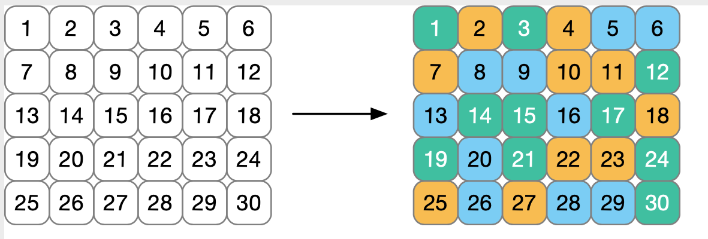
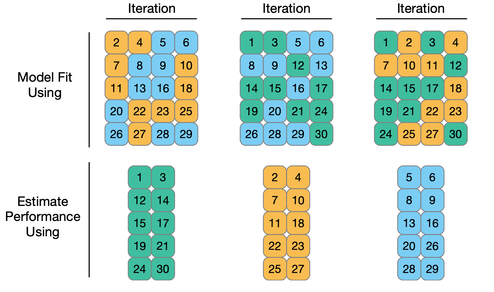

```{r setup, include=FALSE}
knitr::opts_chunk$set(
	echo = FALSE,
	fig.align = "center",
	message = FALSE,
	cache = T,
	fig.width = 6,
	fig.height = 4,
	warning = FALSE,
	out.width = "70%"
)
library(tidyverse)
library(knitr)
library(ggthemes)
library(moderndive)
library(ISLR)
library(moderndive)
```

## Outline

In today's class, we will...


- Define and discuss resampling and cross-validation

- Investigate methods of cross-validation (LOOCV and k-fold cv)

- Implement CV in R
  
# Validation
 

## Poll: Training Error

Which of the following methods are likely to have the smallest training error rate for regression problems?

a. Multiple linear regression

b. Simple linear regression

c. Non-linear regression with polynomials 

d. KNN with K = 1

e. KNN with K = p


## Validation Set

Assessing model accuracy only on training sets will usually under-estimate error
  
  \pause 
  
  - But not all models will have the same bias, making comparison difficult
  
\pause

One fix is to partition data into training and test sets. 

\pause

- Build the model using only the training data

- Assess accuracy using only test data.

 


## Fuel Economy


The `FuelEconomy` data set from the `AppliedPredictiveModeling` package contains fuel efficiency and other variables for 1107 cars and trucks from 2010, with data taken from the <http://fueleconomy.gov> website

\tiny

```{r message = F, echo = T, warning = F}
library(AppliedPredictiveModeling)
data(FuelEconomy)
head(cars2010)
```

## Important Predictors

Let's consider just numeric variable first:


\columnsbegin

\column{.4\textwidth}

\footnotesize

```{r message = F, echo = T, warning = F}
cars2010 %>% 
  select_if(is.numeric) %>% 
  cor(cars2010$FE)
```

\column{.55 \textwidth}

\pause

```{r fig.height=6, 	out.width = "100%"}
library(gridExtra)
g1 <- ggplot(cars2010, aes(x = EngDispl, y = FE))+geom_point(alpha = .5) + geom_smooth(method = "lm", se = F)+theme_bw()
g2 <- ggplot(cars2010, aes(x = NumCyl, y = FE))+geom_point(alpha = .25) + geom_smooth(method = "lm", se = F)+theme_bw()
grid.arrange(g1,g2, ncol = 1)
```

\columnsend

## Collinearity

- We may want to include both `EngDispl` and `NumCyl` in our model for `FE`. 

  - But if both are strongly correlated with `FE`, they may also be strongly correlated with each other...

\pause

```{r fig.height = 3, fig.width = 6, out.width = "60%"}
cars2010 %>% ggplot(aes(x = NumCyl, y = EngDispl))+geom_point(alpha = .25)+geom_smooth(method = "lm", se = F)+theme_bw()
```

\footnotesize

```{r echo = T}
cor(cars2010$EngDispl, cars2010$NumCyl)
```


## Validation Set

Let's create a validation set using `initial_split` in the `rsample` package

\pause

\small

```{r echo = T}
library(rsample)
set.seed(999)
cars_initial <- initial_split(cars2010)
cars_train <- training(cars_initial)
cars_val <- testing(cars_initial)
```


\pause

\normalsize

- The `dim` function in `rsample` returns the number of observations and variables present in a split:

\small
```{r echo = T}
cars_train %>% dim()
cars_val %>% dim()
```


## Two Models


- Since `EngDispl` is most strongly correlated with `FE`, we will include it in our models.

- And we'll create another model that also includes `NumCyl`.

\pause

\columnsbegin
\column{.5 \textwidth}


\tiny

```{r echo = T}
mod1 <- lm(FE ~ EngDispl, data = cars_train)
summary(mod1)
```

\column{.5\textwidth}
\pause

\normalsize


\tiny

```{r echo = T}
mod2 <- lm(FE ~ EngDispl + NumCyl, data = cars_train)
summary(mod2)
```

\columnsend

\pause

- The MLR model has lower RSE, higher $R^2$, and all predictors are significant. But is it really the better model?

## Assess on Validation Set

Let's check MSE on the validation set.

\pause

\small
```{r echo = T}
mod1_preds <- predict(mod1, cars_val)
mod1_mse <- mean( (cars2011$FE - mod1_preds)^2)
mod1_mse
```

\pause

\small 
```{r echo = T}
mod2_preds <- predict(mod2, cars_val)
mod2_mse <- mean( (cars2011$FE - mod2_preds)^2)
mod2_mse
```

\pause

\normalsize

- The MLR model (`mod2`) now has slightly higher MSE than the SLR model (`mod1`)

  - But could this be a fluke of a random validation set?


## Problems with Validation Sets

What are some problems with the Training / Validation approach?

\pause

- If initial data set is small, this further restricts sample size available for model building.
  
  - Both model and test performance may have high variance.
  
\pause
  
- A single test set doesn't give estimates for the range of error

\pause

- Susceptible to bias from particular choice of training set.

\pause

**Resampling** is drawing many samples from your training data and refitting the model for each, in order to learn more about your model.

\pause

**Cross-Validation** is using resampling techniques to assess model accuracy.


# Resampling


## $k$-fold Cross Validation 

- $k$-fold CV randomly partitions data into $k$ sets of size $n/k$.  
  
  - One subset of size $n/k$ is chosen to be the validation set
  
  - Remaining $k-1$ subsets are used as training set to build the model.
  
\pause

- The process is repeated for each possible validation set, and the average error rate computed among all partitions is computed

\pause

- The cross-validation estimate $CV_{(k)}$ for average test MSE is therefore:

\small

$$
CV_{(k)} = \frac{1}{k} \sum_{i =1}^k \textrm{MSE}_i
$$
\normalsize
\pause

\vspace{-1em}

  - Here, $\textrm{MSE}_i$ is test MSE when the $i$th fold is used as validation set.

\pause

- Since the partition into folds is random, $CV_{(k)}$ still has some variability. But less than just using a single validation set.

  \pause

  - To reduce variability further, $k$-fold CV can be performed multiple times, and the results of $CV_{(k)}$ themselves averaged.

## 3-fold CV

- Consider 30 training observations below. Colors indicate a random fold allocation.

```{r}

```

## 3-fold CV

- Each iteration uses 2 of the folds to build a model, and the remaining fold to assess performance.

```{r}

```

- Overall performance is obtained by averaging across iterations.

## CV in R


We'll use the `vfold_cv` function in `rsample` to perform cross-validation.

\small

```{r echo = T}
set.seed(927)
folds_cars <- vfold_cv(cars2010, v = 10)
```

\pause

\normalsize

- The above code breaks the data into 10 (nearly) equal folds and stores results as a resample object with 2 parts:

  - `id`, a vector with fold identifiers (i.e "Fold01", "Fold02", ... )
  
  - `Splits`, a list whose elements correspond to each split of the data into $k-1$ training and $1$ validation sets
  
\pause

- To get the training set for one iteration, we apply `analysis` to one of the `Splits` elements.

\pause

\small

```{r echo = T, eval = F}
folds_cars$splits[[1]] %>% analysis()
```

  
  
\pause

\normalsize

- And to get the corresponding validation set, we apply `assessment` to the same element

\pause

\small

```{r echo = T, eval = F}
folds_cars$splits[[1]] %>% assessment()
```

## Create Functions 

- The `rsample` package does the heavy lifting for partitioning data into appropriate folds. 

  - But it doesn't actually build models or compute MSE
  
  - Let's practice coding!
  
\pause

- **Goal:** Write function to do each of the following

1. Obtain analysis set

2. Fit linear model

3. Predict on assessment data

4. Assess accuracy

\pause

\small

```{r echo = T}
cv_model1 <- function(split){
  mod <- lm(FE ~ EngDispl, data = analysis(split))
  val <- assessment(split)
  preds <- predict(mod, val)
  mse <- mean( (val$FE - preds)^2)
  mse
  }
```


## Get Results!

- Now, we'll apply this function to each split in `folds_cars` using the `map_dbl` function from the `purrr` package

\small

 

```{r echo = T, eval = T}
library(purrr)
folds_cars$mod1_results <- map_dbl(folds_cars$splits, cv_model1)
folds_cars %>% head()
```

\pause

\normalsize

- And to find the average CV MSE, we take the mean of the `results` column:

\small

\pause

```{r echo=T}
CV_MSE_mod1 <- mean(folds_cars$mod1_results)
CV_MSE_mod1
```

## Repeat

And now we repeat, but for `mod2`:

\pause

\small

```{r echo = T}
cv_model2 <- function(split){
  mod <- lm(FE ~ EngDispl + NumCyl, data = analysis(split))
  val <- assessment(split)
  preds <- predict(mod, val)
  mse <- mean( (val$FE - preds)^2)
  mse
}

folds_cars$mod2_results <- map_dbl(folds_cars$splits, cv_model2)

CV_MSE_mod2 <- mean(folds_cars$mod2_results)
```

\pause

```{r echo=T}
data.frame(model = c("1", "2"), cv_mse = c(CV_MSE_mod1, CV_MSE_mod2))
```

\pause
\normalsize

- It looks like after performing 10-fold CV, model 2 is better after all!

## LOOCV

- The special case when $n$ folds are used is called Leave One Out Cross-validation (LOOCV)

  \pause 

  - In this case, the model is fit on all but one observation, and then tested on the lone observation. 
  
  \pause
  
  - The process is repeated so that every observation is a test point, and the results averaged.
  
  \pause
  
  - Because every possible model is fit, LOOCV estimates are a deterministic function of training set (unlike other CV)
  
\pause

- But LOOCV has significant drawbacks:

  \pause
  
  - Because it requires $n$ models, LOOCV is computationally intensive
  
  \pause
  
  - As any two models fit using LOOCV differ with respect to only two observations, the model estimates for different folds are very highly correlated. 
  
  \pause
  
  - Because only a single point is used in the test set, MSE estimates are highly variable.
  
  \pause
  
  - While LOOCV does not consistently have higher variance or lower bias than $k$-fold CV, in almost all cases, it will produce estimates of MSE that are significantly less accurate than other resampling techniques.