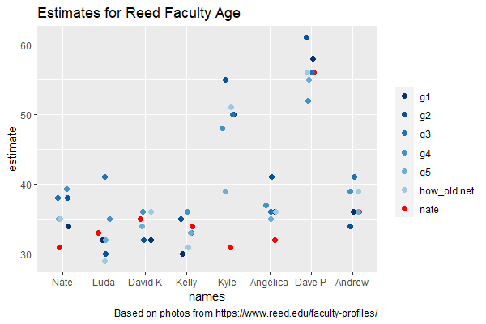

```{r setup, include=FALSE}
knitr::opts_chunk$set(echo = FALSE)
library(tidyverse)
library(knitr)
library(ggthemes)
```

## Outline

In today's class, we will...

\pause

- Discuss the goals of statistical learning algorithms

\pause

- Survey some of the most common methods for statistical learning

\pause

- Analyze data from the `guess my age' activity


# What is Stat Learning?

## The Setting
 
- Fundamentally, stat learning is the study of the relationships between predictor variables $X_1, \dots , X_p$ for a population, and one or more response variables $Y_1, Y_2, \dots$.

  \pause
  
  - Sometimes, we'll study the relationship among predictor variables in isolation (no response)
  
\pause

- In the simplest case, we observe the values of one quantitative response $Y$, as well as $p$ many predictors $X_1, \dots, X_p$.

\pause

- We assume there is a (usually unknown) relationship between these observed values:

$$
Y = f(X_1, \dots, X_p) + \epsilon
$$

  \pause

  - Here, $\epsilon$ denotes a random or unobserved error term **independent** of $X_1, \dots, X_p$

\pause

- The overarching goal of stat learning is to estimate $f$, given data on $X$ and $Y$.


## An Example

Consider the following observations for variables $X$ and $Y$

```{r echo = F}
X = runif(100, 0,1 )
E = rnorm(100, 0, .25)
Y = 2*X + 1 + E

df<-data.frame(X,Y)
```

```{r echo=F, fig.align='center', fig.height = 3, fig.width = 6, out.width = "75%"}
df %>% ggplot(aes(x = X, y = Y)) + geom_point()
```

What is the relationship between $X$ and $Y$?
\pause
\small 
```{r eval = F, echo = T}
X = runif(100, 0,1 )
E = rnorm(100, 0, .25)
Y = 2*X + 1 +  E
```


## Estimating $f$ for Prediction


Prediction is useful in settings where $X$ can be observed, but $Y$ cannot. Ex: 

- Suppose for each Reed faculty, we know the number of years $X$ between when their undergrad degree was awarded and when their faculty picture was taken.

\pause

- Ultimately, we want to estimate the age $Y$ of each faculty member.

\pause

- To do so, we theorize a model that takes in $X$ as input and outputs our best guess $\hat{Y}$ for $Y$.


  \pause
  
  - What is one such possible model $f$?
  
\pause

- But even if we have a perfect estimate for $f$ in $Y = f(X) + \epsilon$, the predicted value $\hat{Y} = f(X)$ of $Y$ may not equal $Y$, since $Y$ also depends on $\epsilon$.

  \pause
  
  - What is one source of error $\epsilon$ in the previous model?

## Types of Error

In general, there are two sources of error in a model $\hat{Y} = \hat{f}(X_1, \dots , X_p)+\epsilon$ for the relationship
$$
Y = f(X_1, \dots, X_p)+\epsilon
$$

\pause

1. Reducible error, in the form of our estimate $\hat{f}$ for $f$.

\pause

2. Irreducible error, in the form of $\epsilon$

\pause

What steps can be taken to improve reducible error?

\pause

What about irreducible error?

## Inference

In many settings, we are interested in the relationship between each predictor $X_1, \dots, X_p$ and the response $Y$.

\pause

1. Which predictors are likely to be associated with response?

\pause

2. What is the degree and strength of the relationship between significant predictors and the response?

\pause

3. What type of relationship exists between the predictors and the response? (Linear? Exponential? Something more complicated?)

\pause

Ex:

\begin{quotation} A data set contains information on a professor's age, gender, tenure-status, ethnicity, and department. Which of these predictors are associated with course evaluation scores, and how?
\end{quotation}

\pause

Here, we are trying to **infer** information about the factors which contribute to course eval score. 

# Methods of Stat Learning

## Parametric Methods

Parametric methods for estimating $f$ involve two steps:

1. Based on domain knowledge, make assumptions about the functional form or shape of $f$. 

\pause

- The linear model is a common choice for the shape of $f$:
\begin{align*}
f(X) =& \beta_0 + \beta_1 X_1 \quad \textrm{simple linear}\\
f(X) =& \beta_0 + \beta_1 X_1 + \dots + \beta_p X_p \quad \textrm{multilinear}
\end{align*}

\pause

2. After a model has been chosen, we implement a procedure for estimating the **parameters** of the model that minimizes the reducible error.

\pause

- In the case of the linear model, we estimate the values of $\beta_0, \dots, \beta_p$ using the *method of least squares*.


$$
\hat\beta_1 = \frac{\sum(x_i - \bar x)(y_i - \bar y)}{\sum (x_i - \bar x)^2} \qquad \hat \beta_0 = \bar y - \hat \beta_1 \bar x
$$

## Non-parametric Methods

Non-parametric methods forgo assumptions on the shape of $f$, working instead in a very general class of functions.

\pause

- In doing so, non-parametric models avoid the problem of mischaracterizing the relationship between predictors and response

\pause

- However, non-parametric models run the risk of **overfitting**, where the model closely matches the observed data, but does not represent the true unobserved relationship between the variables 

  \pause
  
  - How is this possible?
  

\pause

- Non-parametric models often require orders of magnitude more data to make accurate predictions, compared to parametric models

\pause

- Some examples of non-parametric models include: Spline Regression, Support Vector Machines, and Neural Networks

## Techniques and Problems

Most statistical learning **techniques** fall into one of two categories:

\pause

\begin{enumerate}
\item Supervised learning, in which predictors are compared with one or more response variables. 
\begin{itemize} \small
\item Because we have both predicted and actual values of response, we can assess the accuracy of the model.
\end{itemize} \normalsize
\item Unsupervised learning, in which patterns and trends are detected in the predictors without reference to a response variable.
\begin{itemize}\small
\item There is no available metric to determine when the model is performing "well"
\end{itemize}
\end{enumerate}
\normalsize
\pause

Statistical learning **problems** also fall into a pair of categories:

\pause

1. Regression problems, wherein we measure the magnitude of a **quantitative** response variable

\pause

2. Classification problems, wherein we sort a **qualitative** response variable into several discrete classes.


# How Old?
 
## Reflection

**The task:** Consider photos for 8 math and stats faculty at Reed. Estimate the age of each faculty member (at the time photo was taken).

```{r fig.show = 'hold', fig.align = 'center', echo = F, out.width = "10%"}
include_graphics("img/Faculty_Img/img10.jpg")
include_graphics("img/Faculty_Img/img3.jpg")
include_graphics("img/Faculty_Img/img4.jpg")
include_graphics("img/Faculty_Img/img5.jpg")

include_graphics("img/Faculty_Img/img7.jpg")
include_graphics("img/Faculty_Img/img8.jpg")
include_graphics("img/Faculty_Img/img1.jpg")
```

 


\pause

- Was the *How Old?* activity supervised or unsupervised?

\pause

- Did it represent a classification or regression problem?

\pause

- Were you interested primarily in prediction or inference?

\pause

- Did you use parametric or non-parametric methods?

## The Results

```{r out.width = "80%", fig.align='center'}

```

## Debrief

- How should we quantify error?

- What are some sources for error in our estimates?

- How should we assess the overall accuracy of a group's predictions?

- Did any groups seem to consistently over- or under-estimate ages? By how much?

- Do any faculty member ages seem to consistently be over- or under-estimated?

- Are there any faculty members where the guesses seem to be in a particularly large or small range?