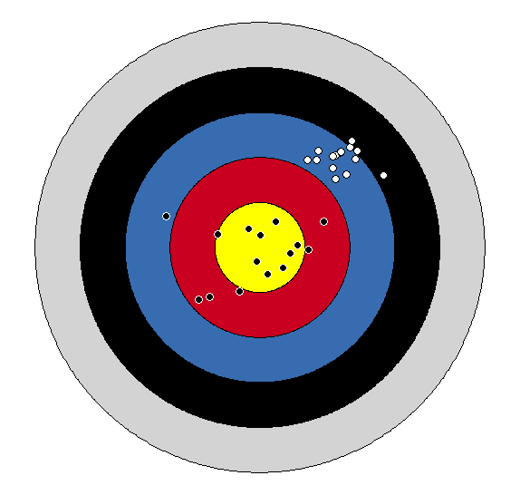

```{r setup, include=FALSE}
knitr::opts_chunk$set(echo = FALSE, fig.align = "center")
library(tidyverse)
library(knitr)
library(ggthemes)
```

## Outline

In today's class, we will...

\pause

- Analyze data from the `guess my age' activity

\pause

- Discuss the Mean Squared Error as measure of model accuracy

\pause
- Investigate the Bias-Variance trade-off

# How Old?
 
## Reflection

**The task:** Consider photos for 8 math and stats faculty at Reed. Estimate the age of each faculty member (at the time photo was taken).

```{r fig.show = 'hold', fig.align = 'center', echo = F, out.width = "10%"}
include_graphics("img/Faculty_Img/img10.jpg")
include_graphics("img/Faculty_Img/img3.jpg")
include_graphics("img/Faculty_Img/img4.jpg")
include_graphics("img/Faculty_Img/img5.jpg")
include_graphics("img/Faculty_Img/img6.jpg")
include_graphics("img/Faculty_Img/img7.jpg")
include_graphics("img/Faculty_Img/img8.jpg")
include_graphics("img/Faculty_Img/img1.jpg")
```

 


\pause

- Was the *How Old?* activity supervised or unsupervised?

\pause

- Did it represent a classification or regression problem?

\pause

- Were you interested primarily in prediction or inference?

\pause

- Did you use parametric or non-parametric methods?

## The Results

```{r out.width = "80%", fig.align='center'}
include_graphics("img/age_color.png")
```

## Debrief

- How should we quantify error?

- What are some sources for error in our estimates?

- How should we assess the overall accuracy of a group's predictions?

- Did any groups seem to consistently over- or under-estimate ages? By how much?

- Do any faculty member ages seem to consistently be over- or under-estimated?

- Are there any faculty members where the guesses seem to be in a particularly large or small range?


# Mean Squared Error
 
## How do we measure quality of a model?

Goal: Devise a quantitative measurement of error for a model. Then develop a general algorithm for finding the model that minimizes this measure of error.

\pause

- For regression, the most common measure of error is the **Mean Squared Error** (MSE):
$$
\mathrm{MSE}(\hat{f}) = \frac{1}{n}\sum_{i=1}^n \Big(y_i - \hat{f}(x_i) \Big)^2
$$
where $\hat{f}$ is the model, the $x_i$ are the observed predictor values, and the $y_i$ are the corresponding observed response values.

\pause

- Under what circumstances is $\mathrm{MSE}$ small?

\pause

- What are the problems with trying to minimize $\mathrm{MSE}$ on the set of observed data $(x_1, y_1), (x_2, y_2), \dots , (x_n, y_n)?$

## Training and Test Data

- **Training Data** is the collection of data we use to build our model. Often, it is a subset of all data we have available.
\pause

- **Test Data** is the collection of data on which we assess the accuracy of our model. It should be distinct from the training data.

\pause


- *Goal*: Use a model-building algorithm that builds model on **training data** in order to minimize $\mathrm{MSE}$ on a large number of unobserved **test data** points $(x_0,y_0)$

  \pause

 - i.e. minimize
$$
\mathrm{Ave}\Big( y_0 - \hat{f}(x_0)  \Big)^2
$$

\pause

- If we have training and test data, we can construct a number of models on the training data, and compare their performance on the test data in order to select the best model

 

##  An Example

- Suppose we wish to predict students' final exam scores $Y$ based on their first midterm scores $X$. We have data from two previous classes.
\pause

\vspace{1em}
- Suppose e don't care about how well our model predicts exam scores for the previous classes. We want to know how well it predicts future scores.

  \pause


  - Use the first class as training data

  - Use the second class as test data


## Training Set

```{r echo = F }
set.seed(241)
mid<-rnorm( 25, .6, .10)
final<-(mid)^(1/2)-.1 + rnorm( 25, 0, .05)
scores<-data.frame(mid, final)
```

 


\small

```{r echo=T, fig.height=4, fig.width=6, out.width = "70%"}
##
##
scores %>% ggplot( aes(x = mid, y = final)) + 
  geom_point()+labs(title = "Class 1")
```

## Model 1

 


\small

```{r echo=T, fig.height=4, fig.width=6, out.width = "70%", message=F}
##
scores %>% ggplot( aes(x = mid, y = final)) + geom_point()+
  labs(title = "Class 1") + 
  geom_smooth( method = "lm" , se = FALSE)
```


## Model 1 and 2

 


\small

```{r echo=T, fig.height=4, fig.width=6, out.width = "70%", message = F}
scores %>% ggplot( aes(x = mid, y = final)) + geom_point() +
  labs(title = "Class 1") + 
  geom_smooth( method = "lm" , se = FALSE) +
  geom_smooth( method = "lm" ,formula = y ~ poly(x, 5), se = FALSE, color = "red")
```

## Test Set

```{r echo = F }
set.seed(1014)
mid<-rnorm( 15, .6, .1)
final<-mid/2+.4 + rnorm( 15, 0, .05)
scores2<-data.frame(mid, final)
```

 

\small

```{r   fig.height=4, fig.width=6, out.width = "70%", message = F}
 ggplot( ) + 
  geom_point(data = scores2, aes(x = mid, y = final))+labs(title = "Class 2")
  #geom_smooth(data = scores, aes(x= mid, y = final), method = "lm" , se = FALSE) +
  #geom_smooth(data = scores, aes(x= mid, y = final),  method = "lm" ,formula = y ~ poly(x, 3), se = FALSE, color = "red")
```


## Test Set with models
 


\small

```{r   fig.height=4, fig.width=6, out.width = "70%", message = F}
 ggplot( ) + 
  geom_point(data = scores2, aes(x = mid, y = final))+labs(title = "Class 2")+
  geom_smooth(data = scores, aes(x= mid, y = final), method = "lm" , se = FALSE) +
  geom_smooth(data = scores, aes(x= mid, y = final),  method = "lm" ,formula = y ~ poly(x, 5), se = FALSE, color = "red")
```

## MSE

```{r echo = F}
lin_mod <- lm( final ~ mid, data = scores)
lin_pred <-predict(lin_mod, scores2)
poly_mod <- lm(final ~ poly(mid, degree = 5), data = scores)
poly_pred <- predict(poly_mod, scores2)

get_MSE <- function(actual, pred){
  mean((actual - pred)^2)
}

lin_mse <- get_MSE(scores2$final, lin_pred)
poly_mse <- get_MSE(scores2$final, poly_pred)

error <- data.frame(actual = scores2$final, lin_pred, poly_pred ) %>% mutate(lin_sq_error = (actual - lin_pred)^2, poly_sq_error = (actual - poly_pred)^2) %>% as_tibble()
```

\small 
Prediction accuracy

\footnotesize

```{r echo = F}
error
```

\pause

\small

Overall MSE

\footnotesize

```{r}
tibble(lin_mse, poly_mse)
```


## Minimize MSE subject to model shape

What if no test data is available?

  \pause

  - Recall the setting of simple linear regression from Math 141.
  
\pause

We can choose a model that minimizes $\mathrm{MSE}$ on the training set, subject to constraints (i.e. restricting to linear, quadratic, exponential models)

  \pause

But no guarantee that model which minimizes $\mathrm{MSE}$ on training data will also do so on test data.

\pause

In fact, when selecting a complex model that minimizes $\mathrm{MSE}$ on the training data, the test $\mathrm{MSE}$ will often be very large!

## Demo in RStudio

See .Rmd file (Wednesday 9-9 Demo) on the schedule page of the course website


# Bias-Variance Trade-off

## Training vs Test MSE

\vspace{-5 em}
Suppose we consider a variety of model shapes to predict $Y$, with each model of increasing complexity. What happens to the training MSE and the test MSE as model complexity increases?

\vfill

## MSE Decomposition

The U-curve for test MSE is a result of competition between two sources of error in a model

\pause

Expected test MSE can be decomposed as the sum of 3 quantities:
$$
\mathrm{E}( y_0 - \hat{f}(x_0))  = \mathrm{Var}(\hat{f}(x_0)) + \left[\mathrm{Bias}(\hat{f}(x_0))\right]^2 + \mathrm{Var}(\epsilon)
$$
  \pause
  
  - Where $\mathrm{E}( y_0 - \hat{f}(x_0))$ denotes expected test MSE **at** $x_0$, if many models for $f$ were built using a variety of random training data sets.
  
  \pause
  
  - Overall expected test MSE is obtained by averaging across all possible $x_0$ in the test set.
  
  \pause
  
  - A proof is given in Section 7.3 of *The Elements of Statistical Learning*
  
\pause

To minimize $\mathrm{MSE}$, we need to *simultaneously* minimize both variance and bias.

## Bias and Variance

- **Variance** refers to the amount of variability in $\hat{f}(x_0)$ across training sets

  \pause
  
  - What type of models tend to have low/high variance?
  
  \pause

\vspace{3 em}  

- **Bias** refers to amount by which the average of estimates $\hat{f}(x_0)$ differs from the true value of $f(x_0)$
   
  - Bias is produced by the difference between model shape assumptions and reality


  \pause
  
  - What type of models tend to have low/high bias?
  

## Target Practice

```{r fig.align="center", out.height = "90%"}

```


## The Trade-off

What is the problem?

\pause

\vspace{7 em}

How do we solve it?

\vspace{7 em}